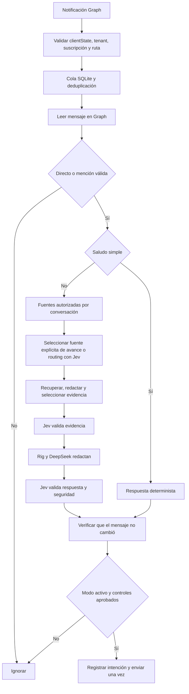

# Asistente personal de Teams

Servicio Rust que lee y responde con la identidad del usuario mediante Microsoft Graph y OAuth delegado. Jev toma decisiones tipadas; Rig y DeepSeek redactan únicamente cuando existe evidencia suficiente. Ante duda, error o necesidad de juicio humano, guarda silencio.

## Ejecutar en un equipo local

Requisitos: Rust (la versión queda fijada en `rust-toolchain.toml`), Git, cuenta Teams de trabajo/escuela, una aplicación Entra, claves de Jev y DeepSeek. Para el arranque local integrado: Python 3.9+, `cloudflared`, Azure CLI y `lazy-workflow`.

```sh
cp config.example.toml config.toml
cp knowledge-map.example.toml knowledge-map.toml
# Completar IDs Entra y rutas; autorizar conversaciones por fuente.
cargo test --locked
cargo run -- check config.toml
python3 scripts/local.py
```

`local.py` levanta el túnel HTTPS, registra su callback en **la app Entra configurada**, carga credenciales desde `lazy-workflow` sin mostrarlas y arranca el servicio local. Abre la URL `/oauth/login` que imprime, introduce `ADMIN_AUTH_KEY` desde tu gestor local y completa el consentimiento de Microsoft. El callback exige la cuenta configurada; OAuth usa PKCE, estado de un solo uso y cookie segura.

Para probar una conversación sin escribir en Teams, abre `<URL pública>/test` (o `http://127.0.0.1:3000/test` en el mismo equipo). Introduce `ADMIN_AUTH_KEY` y chatea: el formulario llama a `POST /test/chat` con `Authorization: Bearer <ADMIN_AUTH_KEY>`, un `session` UUID y `text`; admite `group` y `mentioned` para simular una mención. Usa el mismo pipeline de fuentes, Jev y LLM, pero el adaptador de prueba **nunca envía a Microsoft Graph**. La clave queda solo en la memoria de esa página; no se guarda en el navegador. Reutiliza el mismo `session` para probar “dame más detalles”. El endpoint responde con `status`, `reason` y `answer` solo cuando se aprobó el envío simulado. Un `ignored` significa que algún control dejó la pregunta para respuesta humana.

El modo inicial es `dry_run = true`: recibe mensajes y registra propuestas, **no envía respuestas**. Cambia a `false` y reinicia cuando hayas revisado las fuentes, sus audiencias y los resultados. Los mensajes procesados en dry-run no se reenvían después. El equipo debe permanecer encendido, sin suspensión y conectado a Internet.

Los túneles temporales son para desarrollo, cambian de hostname y no garantizan disponibilidad. Para uso local continuo, utiliza un túnel con hostname estable y supervisor del sistema. No hace falta mover el servicio a la nube: el dominio puede seguir apuntando al equipo local. Ver [despliegue](docs/deployment.md).

## Configuración y credenciales

Todo comportamiento se declara en TOML. `config.toml`, `knowledge-map.toml`, `data/` y `.env` están excluidos de Git. La base de conocimiento debe ser un checkout Git privado. El ejemplo apunta a `../personal-teams-knowledge`.

| Variable secreta | Uso |
| --- | --- |
| `ENTRA_CLIENT_SECRET` | OAuth de la app confidencial |
| `TYPESAFE_API_KEY` | API de Jev |
| `DEEPSEEK_API_KEY` | Generación mediante Rig |
| `ADMIN_AUTH_KEY` | Protege el inicio de OAuth; mínimo 32 caracteres aleatorios |
| `GRAPH_WEBHOOK_SECRET` | `clientState` de notificaciones; 32–128 caracteres aleatorios |
| `STATE_ENCRYPTION_KEY` | 32 bytes aleatorios codificados en base64; cifra tokens OAuth |
| `AZURE_DEVOPS_TOKEN` | PAT de solo lectura para HUs, repositorios, builds y releases; referenciado desde el mapa, nunca desde el catálogo |

Cada secreto admite `NAME_FILE=/run/secrets/name` para Docker/Kubernetes/secret managers. Nunca debe aparecer en TOML, documentos, URLs o repositorios. `secrets` en TOML solo mapea referencias `secret://...` a nombres de variables. La clave de cifrado debe persistir entre reinicios.

Para guardar valores con el CLI indicado:

```sh
lazy-workflow credentials-set --name TYPESAFE_API_KEY --service typesafe
lazy-workflow credentials-set --name ENTRA_CLIENT_SECRET --service teams-assistant
```

El CLI usa entrada oculta. Para ejecutar sin el helper local, carga tus archivos de secretos en la shell y ejecuta `cargo run -- serve config.toml`; configura HTTPS y el callback por separado. Sobrescrituras no secretas: `ENTRA_TENANT_ID`, `ENTRA_CLIENT_ID`, `TEAMS_USER_ID`, `PUBLIC_URL`, `LLM_PROVIDER`, `LLM_MODEL`.

## Flujo



En grupos y canales se verifican IDs de menciones de Graph, nunca el texto `@nombre`. Se ignoran mensajes propios, eliminados, de sistema, antiguos y tipos de chat no compatibles. Los saludos deben coincidir exactamente con la lista normalizada; “hola, ¿cuál es el estado?” sigue el flujo de evidencia.

## Alcance implementado

- Chats directos y menciones en grupos; canales explícitos como adaptación adicional.
- OAuth con refresh tokens cifrados, renovación de suscripciones, lifecycle notifications y cola persistente. `discover_all_chats = true` usa una sola suscripción Graph a los mensajes de todos los chats del usuario.
- Mapa de fuentes, múltiples checkouts Git privados, Markdown/TXT/JSON/TOML/YAML y páginas HTTPS aprobadas.
- Jev usa `choice` para elegir entre fuentes cuando la consulta no identifica una fuente explícita; `noul` para seguimientos y comprobaciones independientes de pertinencia, evidencia, fidelidad, privacidad y compromisos. Los umbrales configurables se aplican a la confianza de `choice` o a la probabilidad afirmativa de cada `noul`; cualquier comprobación insuficiente silencia la respuesta. La autorización de conversación y fuente se verifica en código antes de consultarlo.
- Estado de Azure DevOps de solo lectura: consulta HUs en desarrollo y recién terminadas, tareas relacionadas y, cuando hay repositorios enlazados, commits personales, builds de esos commits y releases clásicos asociados. La organización, los proyectos, el autor y los estados viven en `azure-devops.toml` del repositorio privado de conocimiento; se pueden añadir más fuentes allí. Una fecha objetivo no se presenta como compromiso personal; impedimentos y riesgos no documentados quedan pendientes de confirmación.
- Chat de simulación autenticado en `/test`, con contexto breve por sesión para seguimientos y opción de simular grupos con mención, sin enviar mensajes a Teams.
- `LlmProvider` independiente y DeepSeek mediante Rig. Nuevos proveedores se implementan en `llm`; el pipeline depende solo del trait. Otros proveedores aún no se seleccionan en configuración.
- Traits de herramientas y facade Rig: SQL Server con tres consultas semánticas, Azure DevOps (work item y estado de avance), RabbitMQ (estado de cola) y GET de API interna fija.
- Pruebas unitarias e integración HTTP simulada con Graph, Jev y DeepSeek; CI con fmt, Clippy, tests y build Docker.

## Documentación

- [Registro Entra y permisos](docs/entra.md)
- [Arquitectura, seguridad y límites](docs/architecture.md)
- [Herramientas y conocimiento](docs/knowledge-and-tools.md)
- [Ejecución local y despliegue](docs/deployment.md)

La integración de estado de Azure DevOps se ha probado con la organización configurada. SQL Server y RabbitMQ requieren sus propias instancias y credenciales. Cada herramienta se habilita por recurso y audiencia. El sistema no hace SQL dinámico, no publica en RabbitMQ y no modifica work items.
