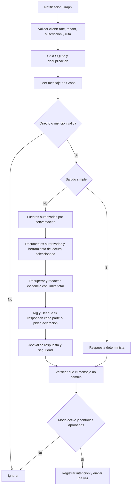

# Asistente personal de Teams

Servicio Rust que lee y responde con la identidad del usuario mediante Microsoft Graph y OAuth delegado. Jev toma decisiones tipadas; Rig y DeepSeek redactan únicamente cuando existe evidencia suficiente. Las consultas se intentan responder con hechos verificables; los datos faltantes se señalan o se pide aclaración. Una respuesta insegura o sin respaldo queda para revisión humana.

## App de escritorio (macOS; Windows en roadmap)

La app Tauri usa el mismo núcleo Rust. En macOS se abre desde la barra de menús; en Windows, desde la bandeja. Su ventana permite configurar credenciales en Keychain/Credential Manager, agregar varios repositorios Git y fuentes, iniciar o detener el asistente y chatear localmente sin enviar respuestas a Teams. La GUI no muestra el valor de una credencial guardada. El chat local necesita las claves de Jev y DeepSeek y al menos una fuente habilitada para procesamiento externo; no necesita la conexión Teams.

Instalación directa con Cargo desde este repositorio:

```sh
cargo install --path desktop/src-tauri --locked
personal-teams-desktop
```

La instalación desde crates.io es `cargo install personal-teams-desktop --version 0.2.0 --locked`. Cargo instala la GUI y `pta`, con la skill incorporada; en macOS el `.app`/`.dmg` ofrece además la integración habitual con Finder y Launch Services.

```sh
cargo tauri build --bundles app,dmg  # desde desktop/src-tauri en macOS
cargo tauri build --bundles nsis     # desde desktop/src-tauri en Windows
```

Para importar la instalación anterior, indica la ruta a su `config.toml` en **Migrar esta instalación** e importa `STATE_ENCRYPTION_KEY` desde tu gestor local. Se conservan client ID, mapa y SQLite. El login de escritorio usa el **mismo registro Entra y los mismos scopes Graph** (`offline_access User.Read Chat.Read ChatMessage.Send`). El registro existente ya admite `http://localhost` como redirección de escritorio y cuentas de otras organizaciones; no se añadieron permisos Graph. Iniciar sesión de nuevo puede ser necesario. Si Microsoft muestra un consentimiento inesperado para tu propia cuenta, revisa la configuración antes de aceptarlo. Cada persona de otra organización configura su tenant y solicita acceso al iniciar sesión; su administrador decide si aprueba la solicitud según la política de esa organización. También puede usar su propio registro Entra con esos mismos permisos.

Para recibir webhooks Graph, configura una URL HTTPS estable que alcance el puerto local. Se puede indicar un archivo privado `cloudflared` de túnel local administrado en la GUI: debe tener un hostname igual a la URL pública, servicio `http://127.0.0.1:<puerto>` y regla final `http_status:404`; la app supervisa y detiene ese proceso. Si un supervisor externo gestiona el túnel, deja el campo vacío. No uses Quick Tunnel para suscripciones duraderas.

Para un túnel administrado en Cloudflare, activa **Iniciar y detener Cloudflare Tunnel con el asistente** y guarda `CLOUDFLARE_TUNNEL_TOKEN` en Credenciales. El token se pasa a `cloudflared` solo mediante el entorno del proceso hijo; no aparece en argumentos, TOML ni logs. Configura en Cloudflare el hostname público y el servicio local, con una regla final `http_status:404`, y deja vacío el archivo de configuración local. La app necesita `cloudflared` instalado.

Para GitHub integrado, instala [Personal Teams Knowledge Reader](https://github.com/apps/personal-teams-knowledge-reader) únicamente en los repositorios que autorizas. En **Conocimiento**, conecta con el Client ID público ya precargado mediante Device Flow y clona el repositorio elegido. La app usa `Contents: read`, guarda el token en el almacén del sistema y no incrusta claves privadas. También puedes agregar un checkout local autenticado por GitHub Desktop o Git. Quitar un repositorio del mapa no borra sus archivos.

El código fuente actual se puede auditar, pero el historial anterior incluye ejemplos personales y de proyectos. Para un repositorio público, ejecuta `python3 scripts/export-public.py /ruta/nueva/source.tar.gz` y publica ese **snapshot sin el historial privado**, tras revisar su contenido. El exportador excluye archivos ignorados, configuración local, bases SQLite y checkouts de conocimiento y exige un escaneo con Gitleaks. El proyecto no incluye certificados de firma de Apple o Windows; el `.dmg` local se genera sin notarización.

El CLI administrativo comparte el servicio, configuración, credenciales y mapa de la GUI. Consulta [CLI y skill](docs/cli.md) para instalación en PATH, contrato JSON, OAuth, fuentes, límites de respuestas y chat personal.

## Ejecutar en un equipo local

Requisitos: Rust (la versión queda fijada en `rust-toolchain.toml`), Git, cuenta Teams de trabajo/escuela, una aplicación Entra, claves de Jev y DeepSeek. Para el arranque local integrado: Python 3.9+, `cloudflared`, Azure CLI y `lazy-workflow`.

```sh
cp config.example.toml config.toml
cp knowledge-map.example.toml knowledge-map.toml
# Completar IDs Entra y rutas; autorizar conversaciones por fuente.
cargo test --locked
cargo run -- check config.toml
python3 scripts/local.py
```

`local.py` levanta el túnel HTTPS, registra su callback en **la app Entra configurada**, carga credenciales desde `lazy-workflow` sin mostrarlas y arranca el servicio local. Abre la URL `/oauth/login` que imprime, introduce `ADMIN_AUTH_KEY` desde tu gestor local y completa el consentimiento de Microsoft. El callback exige la cuenta configurada; OAuth usa PKCE, estado de un solo uso y cookie segura.

Deja abierta la terminal donde ejecutaste `python3 scripts/local.py`. La URL vigente se muestra al arrancar y también se puede consultar con `cat data/local-url.txt`. Para detener el servicio **y** el túnel, pulsa `Ctrl-C` en esa terminal; para volver a iniciarlos, ejecuta de nuevo `python3 scripts/local.py` desde el repositorio. Cada inicio con Quick Tunnel genera una URL nueva y el script actualiza el callback de Entra. Si arrancaste el script en segundo plano, localiza su proceso con `pgrep -fl 'scripts/local.py'` y envía `kill -TERM <PID>` al PID correspondiente; el script detiene sus procesos hijos.

Para probar una conversación sin escribir en Teams, abre `<URL vigente>/test` (o `http://127.0.0.1:3000/test` en el mismo equipo). En macOS puedes copiar la clave sin mostrarla con `lazy-workflow credentials-get --name ADMIN_AUTH_KEY --force --no-log-file | pbcopy`; pégala en la página y chatea. El formulario llama a `POST /test/chat` con `Authorization: Bearer <ADMIN_AUTH_KEY>`, un `session` UUID y `text`; admite `group` y `mentioned` para simular una mención. Usa el mismo pipeline de fuentes, Jev y LLM, pero el adaptador de prueba **nunca envía a Microsoft Graph**. La clave queda solo en la memoria de esa página; no se guarda en el navegador. Reutiliza el mismo `session` para probar “dame más detalles”. El endpoint responde con `status`, `reason` y `answer` solo cuando se aprobó el envío simulado. Un `ignored` significa que algún control dejó la pregunta para respuesta humana.

El modo inicial es `dry_run = true`: recibe mensajes y registra propuestas, **no envía respuestas**. Cambia a `false` y reinicia cuando hayas revisado las fuentes, sus audiencias y los resultados. Los mensajes procesados en dry-run no se reenvían después. El equipo debe permanecer encendido, sin suspensión y conectado a Internet.

Los túneles temporales son para desarrollo, cambian de hostname y no garantizan disponibilidad. Para uso local continuo, utiliza un túnel con hostname estable y supervisor del sistema. No hace falta mover el servicio a la nube: el dominio puede seguir apuntando al equipo local. Ver [despliegue](docs/deployment.md).

## Configuración y credenciales

Todo comportamiento se declara en TOML. `config.toml`, `knowledge-map.toml`, `data/` y `.env` están excluidos de Git. La base de conocimiento debe ser un checkout Git privado. El ejemplo apunta a `../knowledge-repo`.

| Variable secreta | Uso |
| --- | --- |
| `ENTRA_CLIENT_SECRET` | OAuth de la app confidencial |
| `TYPESAFE_API_KEY` | API de Jev |
| `DEEPSEEK_API_KEY` | Generación mediante Rig |
| `ADMIN_AUTH_KEY` | Protege el inicio de OAuth; mínimo 32 caracteres aleatorios |
| `GRAPH_WEBHOOK_SECRET` | `clientState` de notificaciones; 32–128 caracteres aleatorios |
| `STATE_ENCRYPTION_KEY` | 32 bytes aleatorios codificados en base64; cifra tokens OAuth |
| `AZURE_DEVOPS_TOKEN` | PAT de solo lectura para HUs, repositorios, builds y releases; referenciado desde el mapa, nunca desde el catálogo |

Cada secreto admite `NAME_FILE=/run/secrets/name` para Docker/Kubernetes/secret managers. Nunca debe aparecer en TOML, documentos, URLs o repositorios. `secrets` en TOML solo mapea referencias `secret://...` a nombres de variables. La clave de cifrado debe persistir entre reinicios.

Para guardar valores con el CLI indicado:

```sh
lazy-workflow credentials-set --name TYPESAFE_API_KEY --service typesafe
lazy-workflow credentials-set --name ENTRA_CLIENT_SECRET --service teams-assistant
```

El CLI usa entrada oculta. Para ejecutar sin el helper local, carga tus archivos de secretos en la shell y ejecuta `cargo run -- serve config.toml`; configura HTTPS y el callback por separado. Sobrescrituras no secretas: `ENTRA_TENANT_ID`, `ENTRA_CLIENT_ID`, `TEAMS_USER_ID`, `PUBLIC_URL`, `LLM_PROVIDER`, `LLM_MODEL`.

## Flujo



En grupos y canales se verifican IDs de menciones de Graph, nunca el texto `@nombre`. Los mensajes propios solo se admiten en el chat personal validado y habilitado; las salidas del asistente se excluyen mediante registro durable. Se ignoran mensajes eliminados, de sistema, antiguos y tipos de chat no compatibles. Los saludos deben coincidir exactamente con la lista normalizada; “hola, ¿cuál es el estado?” sigue el flujo de evidencia.

## Alcance implementado

- Chats directos y menciones en grupos; canales explícitos como adaptación adicional.
- OAuth con refresh tokens cifrados, renovación de suscripciones, lifecycle notifications y cola persistente. `discover_all_chats = true` usa una sola suscripción Graph a los mensajes de todos los chats del usuario.
- Mapa de fuentes, múltiples checkouts Git privados, Markdown/TXT/JSON/TOML/YAML y páginas HTTPS aprobadas.
- No hay veto Jev previo por tema, seguimiento o pertinencia de documentos. Se leen los documentos autorizados, compartiendo `max_context_chars`, y se conserva el intercambio anterior como referencia, con prioridad para la solicitud actual. Jev usa `choice` únicamente para seleccionar una herramienta de lectura cuando no hay una ruta explícita; una decisión incierta no cancela la respuesta basada en documentos ni la petición de aclaración. El control final `noul` verifica respaldo, privacidad, pertinencia y ausencia de nuevas promesas. Las audiencias, la redacción y los límites de acceso siguen verificándose en código. `follow_up_threshold` y `evidence_threshold` se conservan para compatibilidad con perfiles anteriores, pero ya no descartan preguntas.
- Estado de Azure DevOps de solo lectura: consulta work items recientes, commits personales, archivos modificados, ejecuciones de pipelines y sus etapas, definiciones de release configuradas y releases clásicos asociados. Git y pipelines se consultan aunque no haya HU enlazada. La organización, los proyectos y el autor viven en `azure-devops.toml` del repositorio privado de conocimiento; `projects = ["*"]` descubre los proyectos accesibles y solo incluye en la respuesta los que muestran actividad. El índice SQLite en `data/assistant.db` conserva el catálogo y los commits de cada repositorio: actualiza los repositorios activos cada cinco minutos y vuelve a explorar los demás cada seis horas. Una actividad recién iniciada en un repositorio inactivo puede tardar hasta seis horas en aparecer. El informe también consulta mensajes recientes de Teams: en la simulación administrativa busca conversaciones pertinentes del usuario; en una conversación real solo lee el chat donde se pidió el informe. Los mensajes aportan contexto y planes, no prueban por sí solos una ejecución. Una fecha objetivo no se presenta como compromiso personal; impedimentos y riesgos no documentados quedan pendientes de confirmación.
- Chat de simulación autenticado en `/test`, con contexto breve por sesión para seguimientos y opción de simular grupos con mención, sin enviar mensajes a Teams.
- `LlmProvider` independiente y DeepSeek mediante Rig. Nuevos proveedores se implementan en `llm`; el pipeline depende solo del trait. Otros proveedores aún no se seleccionan en configuración.
- Traits de herramientas y facade Rig: SQL Server con tres consultas semánticas, Azure DevOps (work item y estado de avance), RabbitMQ (estado de cola) y GET de API interna fija.
- Pruebas unitarias e integración HTTP simulada con Graph, Jev y DeepSeek; CI con fmt, Clippy, tests y build Docker.

## Documentación

- [Registro Entra y permisos](docs/entra.md)
- [Arquitectura, seguridad y límites](docs/architecture.md)
- [Herramientas y conocimiento](docs/knowledge-and-tools.md)
- [Ejecución local y despliegue](docs/deployment.md)

La integración de estado de Azure DevOps se ha probado con la organización configurada. SQL Server y RabbitMQ requieren sus propias instancias y credenciales. Cada herramienta se habilita por recurso y audiencia. El sistema no hace SQL dinámico, no publica en RabbitMQ y no modifica work items.
