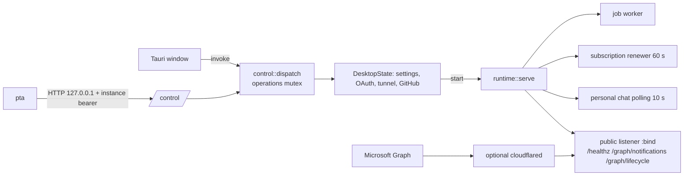
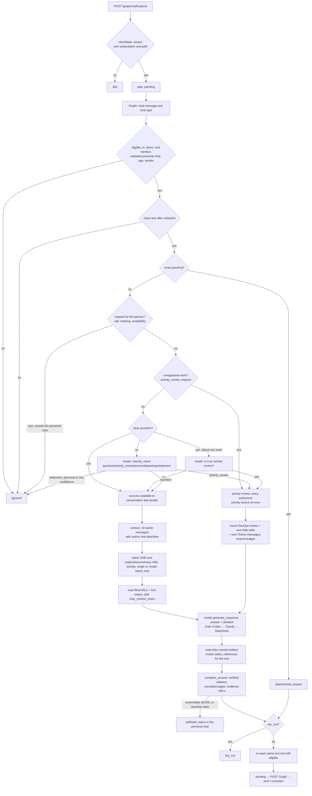

# Architecture

Technical reference for coding agents. It describes how the system is built, how a message flows through it and which invariants cannot be broken. The operating manual (`pta` commands) is the [built-in skill](../desktop/skills/personal-teams-assistant/SKILL.md).

## 1. What it is

A personal Microsoft Teams assistant that answers **as the user** (delegated OAuth, no bot). It receives messages through Microsoft Graph webhooks, decides whether to step in, retrieves evidence only from sources authorized for that conversation, writes with a language model (Codex or Claude Code through their installed CLI, or the DeepSeek API, in a fallback chain), checks references, URLs and sensitive data in code and sends once. If a code check withholds the answer, nothing is sent: the answer is left to the person (and in the personal chat they get a notice). The same model chain classifies ambiguous messages and picks the references an answer uses; no model decision withholds an answer or grants a permission. Azure DevOps writes register the user's unlinked work with a separate credential: personal-chat linking or task creation after exact-plan confirmation (§6.10), and opt-in local/scheduled completed tasks (§6.11).

An additional opt-in host process registers performed work as completed Azure DevOps tasks, manually or on a schedule (§6.11). It uses the same separate write credential, verifies the HU, fields and effort budget, and persists each attempt before the one request. Ambiguities stay pending for local/CLI clarification.

Everything in the repository — code, comments, prompts, documentation, GUI, CLI and audit steps — is in English. What the assistant writes to Teams follows `llm.language` (Spanish by default, or English).

It is distributed only through Cargo. One package, `personal-teams-assistant`, installs three pieces (up to 0.4.0 the app came in a separate package, `personal-teams-desktop`, now obsolete):

| Piece | Binary / path | Role |
| --- | --- | --- |
| GUI + host | `personal-teams-assistant` | Tauri tray/menu bar app. It is the **only owner** of the profile, the credentials and the Teams service. It can run hidden (`--host`) or **headless** (`--headless`, or built without the `gui` feature for Linux/servers). |
| CLI | `pta` | Administrative client. Talks to the host over authenticated loopback IPC; starts it hidden if there is none. |
| Skill | `desktop/skills/personal-teams-assistant/` | Manual for agents, built into `pta` (`pta skill show/path/install`). |

## 2. Repository layout

```text
Cargo.toml                    single package `personal-teams-assistant`: library + binaries
                              `personal-teams-assistant` (GUI/host) and `pta`; `gui` feature (Tauri)
build.rs                      tauri-build from `desktop/` (only with `gui`), into OUT_DIR
src/                          core: pipeline, Graph adapters, LLM, knowledge, tools, SQLite
  llm.rs                      LlmProvider contract, prompts (`Model`), fallback chain (`Chain`), validation
  llm/deepseek.rs             DeepSeek API (`/chat/completions`)
  llm/agent.rs                Codex (`codex exec`) and Claude Code (`claude -p`) as tool-less CLIs; catalog
  ado.rs                      Azure DevOps activity for status questions (work items, commits, pipelines)
  ado/review.rs               activity review: own work compared with work items, verified links
  ado/link.rs                 linking unlinked work to a work item: offer, plan, the one confirmed write
  ado/registration.rs         daily effort deltas, task field/state schema, validate-only and Done creation
  activity.rs, activity/      local/scheduled task planning and durable daily history/clarification
  ado/wiki.rs                 Wiki search/read with verified authorship; own edits for reviews
  app.rs                      host: Host/Shell, state, start/stop, OAuth, tunnel, settings, `run` entry
  app/gui.rs                  Tauri shell (`gui` feature): window, tray, the WebView's `command`
  app/headless.rs             headless shell: foreground, SIGTERM/Ctrl-C, `--start`
  app/web.rs, app/web/         browser GUI, Access-bound sessions, isolated per-user host processes
  app/control.rs              profile paths, IPC channel (contract 1), single dispatcher, update
  app/cli.rs                  `pta`: help, parsing, argument validation, translation to IPC methods
  app/github.rs               GitHub App with Device Flow, clone/sync without a token in URL/argv
  app/skill.rs                skill texts embedded with include_str!
  app/activity.rs             host scheduler, asynchronous activity IPC, shared Graph token owner
  main.rs, bin/pta.rs         binaries (`app::run`, `app::cli::run`)
desktop/                      app resources: tauri.conf.json, Info.plist, capabilities/, icons/
  ui/                         shared HTML/CSS/JS; transport.js selects Tauri invoke or authenticated web API
  skills/                     operating skill (canonical source)
site/                         static landing outside the Cargo package: `public/` (HTML and CSS without
                              JavaScript or a build, `_headers`, `404.html`, GUI screenshots with
                              synthetic data) and `wrangler.jsonc` (Cloudflare Workers, assets only)
tests/integration.rs          integration with wiremock (Graph, DeepSeek) and test doubles
config.example.toml           profile template (`Config::desktop_template`)
knowledge-map.example.toml    synthetic example of the source map
scripts/export-public.py      exports a snapshot without private history (requires gitleaks)
.agents/skills/save-knowledge to save facts into the knowledge base
```

## 3. Process model



- **Host and shell.** `Host` = `DesktopState` (operations) + `Shell` (what the owning process can do: show/hide the window, open a URL, quit). `gui::TauriShell` implements it with Tauri; `headless::HeadlessShell` answers `not_ready` to `app open/hide`, returns URLs to the caller and ends the process on `app quit`. No operation depends on Tauri.
- **One host per profile.** `control.lock` (flock) proves ownership; `control.json` publishes port, random token and `wiki_support`. A descriptor without a lock is stale. A process is never signaled by PID.
- **IPC.** `POST /control` on an ephemeral loopback port, constant-time bearer, rejects any `Origin` (browsers). Body at most 1 MB, client timeout 120 s (no limit for `chat` and `test_providers`, which wait for the model).
- **Single dispatcher.** GUI and CLI go through `control::dispatch`, which serializes with `operations` and checks `revision` (SHA-256 of config + map + tunnel) for writes based on a snapshot. While a Microsoft/GitHub login is pending only reads are allowed.
- **Update.** `cargo install` runs nothing when it finishes and replaces the file while the previous host keeps running. `control.json` publishes `binary` (size and date of the executable at start; older hosts do not have it). If the running host was started from the **same installed path** and its fingerprint no longer matches, it is outdated (`control::outdated_host`): the first `pta` (except `capabilities`, `skill` and `doctor --offline`) or the new app retires it (`retire_outdated_host`: reads whether the assistant was running, sends `app_quit` — which stops assistant and tunnel — and waits for the lock, 60 s). If it was running, `pta` asks on the terminal whether to keep it running with the new version (without a terminal, `--json` or `--non-interactive` keeps the state); the new GUI shows the `restart_offer` notice (`start_assistant` or `dismiss_restart_offer`); the headless host asks if there is a terminal or keeps the state. `start`, `restart`, `stop` and `app quit` decide the state themselves. A host started from another path (e.g. a development build) is never retired this way.
- **The CLI starts the host** (`host_executable`: sibling binary or `host-path.txt`) with `--host` in its own process group and waits for the descriptor. The host inherits `pta`'s environment (`NAME`/`NAME_FILE` credentials, `PTA_HEADLESS`).
- **Service.** `runtime::serve` runs as a Tokio task inside the host. `app.rs::start` launches it, waits for `ready` (60 s) and then starts `cloudflared` if needed. `stop` kills the tunnel, sends `true` on the `watch` and waits 20 s before aborting. Closing the channel also counts as a stop.
- **Activity registration.** `control::launch` owns a separate 30-second scheduler. Runs/refinements return immediately and run in a tracked task; reads remain available, and settings/identity mutations are blocked during a run. It does not need Teams reception or a public listener. `runtime::serve` returns its Graph handle on readiness so the recorder shares the existing OAuth refresh owner; a stopped service's handle can still read chats. Quitting the host aborts registration and recovers any in-flight write as uncertain.

### Browser GUI and independent accounts

`personal-teams-assistant --web` serves the same `desktop/ui` assets on a separate
loopback listener (default `127.0.0.1:38656`), with an HTTPS origin through the
dedicated Cloudflare Tunnel. Cloudflare Access owns the interactive GitHub login,
using a dedicated OAuth App unrelated to repository GitHub Device Flow. Access
protects the complete hostname and API; an explicit email allowlist plus the
configured GitHub login method gates admission at the edge. Admission never
creates or selects an application profile.

`app/web/access.rs` accepts exactly one `Cf-Access-Jwt-Assertion` and verifies
RS256 signature, pinned issuer/application audience, required subject/issuance/
not-before/expiration and application token type. Keys come only from the team's
HTTPS `/cdn-cgi/access/certs`, with bounded responses, five-minute freshness and
rate-limited rotation refresh. Expired keys are never used after a failed refresh.
The exact verified assertion is sent as `CF_Authorization` to the pinned team's
`/cdn-cgi/access/get-identity`; account, GitHub IdP ID/type and `user_uuid == sub`
are checked. Positive identity responses are cached by assertion hash for at most
30 seconds; JWT validity and local revocation are checked on every request.
Identity/email headers, service tokens and caller-selected URLs grant no access.

`pta web configure` writes private `web/settings.json`, whose additive `access`
configuration contains issuer, audience, account and dedicated GitHub IdP ID.
Legacy settings remain readable for inspection; a portal cannot start without
Access. `pta web users add/bind/unbind/revoke/disable/enable/list` manages private
`web/accounts.json` under the existing operator-local lock. `bind` takes the
operator's verified Access identity JSON on stdin. Its binding is the issuer,
GitHub IdP ID and provider subject (`id` from get-identity). GitHub's positive
integer IDs are normalized losslessly to decimal strings; legacy string subjects
remain readable. Floats, negative/zero integers and other JSON types are rejected.
The binding is never an email, name or email-associated Access `sub`.
Bindings cannot belong to two accounts. Existing
IDs, profile selection and retired password hashes survive additive schema reads;
hashes are never used to authenticate. Local association/reassociation is the
recovery path; there is no public registration or password endpoint/form.

`GET /login` exchanges a verified, enabled, explicitly associated identity for a
random local session and serves the shared panel document without another form.
This ends the cross-site OAuth navigation before asset/API requests need the
SameSite=Strict cookie, avoiding a redirect loop without weakening its protection.
An existing first-party session may redirect to `/`. Sessions
are bound to the exact Access assertion, provider binding, Access subject and
account version, and expire at the earlier of local duration or JWT expiration.
Cookies are HttpOnly/SameSite=Strict and host-only Secure on HTTPS. Every browser
POST requires the exact configured Origin and a session-specific CSRF header.
Logout revokes the local session and persists the assertion fingerprint until its
expiration in private `web/access-revocations.json`, then the browser visits
`/cdn-cgi/access/logout` to revoke Access and clear its application cookie. Local
`users revoke` also sets an issuance cutoff so old Access assertions cannot open
new sessions. Disable, unbind and rebind take effect on the next request.

Hosts advertise additive `web_access_support` in their IPC descriptors and CLI
capabilities. The portal refuses to reuse a password-era host, and account edits
refuse to migrate the schema while one is running. A controlled Mac transition
updates the compatible host/CLI pair and preserves the previous assistant state.
The native transport remains unchanged and never accepts browser credentials.

Each web account gets an opaque-ID directory `web/profiles/<id>/`, its own settings,
map, SQLite data, file credentials and provider home, and a separate instance of
the same headless host binary. `PTA_PROFILE_DIR` selects that explicit absolute
profile; the existing desktop profile and Keychain identifiers remain unchanged
when it is absent. New web profiles use DeepSeek, with their own key, by default.
The portal and CLI scrub inherited app/provider credentials when launching isolated
hosts, preserve proxy/CA configuration, and use private credential files on all OSes.
These are application profiles under one trusted operator's OS account, not OS-level tenants.

One account may instead use `pta web users add USER --current-profile` followed by a local identity association to operate
the existing GUI/headless host and its actual data without a copy or re-login.
The portal selects each IPC descriptor from the authenticated account, strips browser
transport headers and uses the existing instance bearer. IPC itself still rejects
Origin and never accepts cookies. A web command allowlist, immutable hosting/data
paths, canonical repository roots and confined imports prevent access to another
profile's data through GUI operations. Current-profile repositories already in the
saved desktop map remain available. Tenant/user identities cannot be reused across
profiles: portal operations and host start check them, and a duplicate new Microsoft
login is logged out locally before an assistant can start.

Graph URLs use optional `server.webhook_prefix` (empty and omitted for existing
profiles, `/webhooks/<opaque-id>` for isolated profiles). The portal forwards only
the matching notifications/lifecycle POST to that host's loopback service, with no
browser cookies or administration token. All existing Graph batch checks remain
in that host. One Cloudflare hostname covers the GUI and every user's callbacks.
The prefix is canonical and validated; it does not change OAuth scopes or redirects.
On a remote device the GUI offers the existing loopback redirect paste/forward
workflow, while GitHub uses its existing device flow. Activities open in the web tab.

The portal owns its own lock, starts enabled profile hosts for offline scheduling,
remembers explicit Assistant Start/Stop state in private `web/resume/<id>` files,
and stops only processes it started on exit. Disabling an account revokes access
immediately and its portal-owned host on reconciliation. The tunnel setup helper
`scripts/configure-web-cloudflare.py` needs a Cloudflare API token, creates a
dedicated remotely managed Tunnel/DNS route, saves its connector token privately
and refuses to replace unrelated DNS or Tunnel routes. The existing static landing
and desktop tunnel remain separate. `scripts/configure-web-access.py` separately
creates/reuses only the dedicated GitHub IdP and panel/Graph Access applications,
rejects overlapping unmanaged resources, installs only explicit callback paths
exported by `pta web callbacks` before protecting the hostname, and verifies
readback before writing private portal settings. No broad `/webhooks/*` bypass is
allowed. The backend exempts only canonical notification/lifecycle POST paths;
Graph forwarding and its existing batch authentication stay unchanged. The current
profile's separate desktop Graph hostname/tunnel remains unchanged. See the [web operating guide](../desktop/skills/personal-teams-assistant/references/web-access.md).

### Headless host (Linux and servers)

```sh
cargo install personal-teams-assistant --no-default-features --locked   # no Tauri/WebKit
personal-teams-assistant --headless --start                              # foreground; `--start` starts the service
```

- Without the `gui` feature the binary is always headless; with it, `--headless` or `PTA_HEADLESS=1` force it. Same profile, contract and operations as the GUI; operated only with `pta`.
- It runs in the foreground: `pta app quit`, SIGTERM or Ctrl-C stop service and tunnel before exiting. A second host on the same profile exits with code 1. Logs go to stderr (no ANSI outside a terminal), fit for journald.
- `--start` tries to start the service; if it fails, the host stays alive to diagnose with `pta status/doctor/audit`.
- Remote Microsoft login: `pta auth microsoft login --no-browser` returns the URL; after authorizing on any device, the browser cannot open `http://localhost:PORT/?code=…`; that URL is pasted into `pta auth microsoft finish --redirect 'URL'` and the host forwards it to its own loopback listener (`forward_microsoft_redirect`: same pending port, rejected at once if the callback does not accept it). Alternative: migrate an existing profile with `pta config import` plus `STATE_ENCRYPTION_KEY`.
- The server still needs a stable HTTPS URL to the listener (Cloudflare tunnel with a token) and must not coexist with another active instance of the same account: it would duplicate answers and cause loops in the personal chat.

## 4. Profile, data and credentials

**This is what keeps the user's session: do not change names or paths.**

| Item | Location |
| --- | --- |
| Profile (Tauri identifier `dev.personalteams.assistant`) | macOS `~/Library/Application Support/dev.personalteams.assistant/`; Windows `%APPDATA%\dev.personalteams.assistant\`; Linux `${XDG_CONFIG_HOME:-~/.config}/dev.personalteams.assistant/` |
| Profile files | `config.toml`, `knowledge-map.toml`, `cloudflared-path.txt`, `control.json`, `control.lock`, `host-path.txt`, `settings-rollback.json` (transient journal), `skills/` |
| Data directory | `config.server.data_dir` (the imported one is kept; it may be outside the profile). In a new profile: the profile's own on macOS/Windows, `${XDG_DATA_HOME:-~/.local/share}/dev.personalteams.assistant/` on Linux |
| Data | `assistant.db` (service), `desktop-chat.db` (local chat/simulation), `activity-registration.db` (runs, tasks and persistent decisions), `activity-cache.db` (isolated evidence cache), `instance.lock`, `repositories/` (GitHub clones) |
| Credentials | macOS Keychain / Credential Manager, service `personal-teams-assistant.default`, account = credential name. Linux: files `<profile>/credentials/default/NAME` (0600, directory 0700) |

Resolving a secret (`security::secret`): `NAME_FILE` → variable `NAME` → system store (Keychain/Credential Manager, or the file store on Linux, configured by `configure_credentials`). `secret_source` only inspects metadata (on macOS it uses `/usr/bin/security find-generic-password` without decrypting). Known credentials: `DEEPSEEK_API_KEY` (required at start only if DeepSeek is active in `llm.chain`; otherwise `credentials list` shows it as `unused`), `GRAPH_WEBHOOK_SECRET` and `STATE_ENCRYPTION_KEY` (both generated at the first start if missing), `CLOUDFLARE_TUNNEL_TOKEN` (tunnel mode with a token), `GITHUB_OAUTH_TOKENS`, and those mapped in `[secrets]` (e.g. `AZURE_DEVOPS_TOKEN`). `TYPESAFE_API_KEY` is retired (`app::RETIRED_CREDENTIALS`): nothing reads it, it cannot be set, and a stored one is listed as `retired` so it can be removed; it is never deleted automatically.

**Local development without Keychain prompts (macOS).** Every `cargo build` produces a new ad-hoc signature, so the Keychain treats each build as a different application and asks again for the items of `personal-teams-assistant.default`. Resolve the credentials from private files instead. Bootstrap once (each read may ask for the login password; let the human click "Always Allow" — `/usr/bin/security` is Apple-signed, so that grant sticks):

```sh
mkdir -p ~/.config/pta && chmod 700 ~/.config/pta
for n in STATE_ENCRYPTION_KEY GRAPH_WEBHOOK_SECRET DEEPSEEK_API_KEY AZURE_DEVOPS_TOKEN GITHUB_OAUTH_TOKENS CLOUDFLARE_TUNNEL_TOKEN; do
  f="$HOME/.config/pta/$n"
  if v=$(security find-generic-password -w -s personal-teams-assistant.default -a "$n" 2>/dev/null); then
    printf '%s\n' "$v" > "$f" && chmod 600 "$f"
  else
    rm -f "$f"
  fi
done
```

Then `source scripts/dev-env.sh` before `cargo run` / `cargo tauri dev`: it exports `NAME_FILE` for every non-empty file in `~/.config/pta` (override the directory with `PTA_DEV_CREDENTIALS_DIR`). `STATE_ENCRYPTION_KEY` must keep its current value or `assistant.db` cannot be decrypted. Reads use the files; `pta credentials set` and the GitHub login still write to the Keychain.

Invariants:

- `STATE_ENCRYPTION_KEY` (base64 of 32 bytes) encrypts the OAuth tokens in `vault` with AES-256-GCM-SIV (AAD `teams-oauth-v1`). It cannot be replaced or deleted while `assistant.db` exists; importing a different key is rejected (`validate_state_key`).
- A database is never reused with another tenant/client/user (`protect_identity`).
- Profile writes: temporary 0600 file + atomic rename; `commit_settings` writes a journal and rolls back on failure; the next host recovers a pending journal.
- Directories 0700 / the account's ACL on Windows.
- On Linux the file store keeps values in clear (protected only by permissions), next to the database whose tokens `STATE_ENCRYPTION_KEY` encrypts. On a server, prefer systemd credentials or a secret manager mounted through `NAME_FILE`.

## 5. Configuration

`Config` (`src/config.rs`) and `KnowledgeMap` (`src/knowledge.rs`) use `deny_unknown_fields`. **Do not remove or rename fields**: existing profiles (and older hosts sharing the profile) would stop loading. Add fields only with `#[serde(default)]`. The single exception is the retired `[jev]` section of profiles written before 0.6.1: `Config::retired_reviewer` (`rename = "jev"`, `IgnoredAny`, `skip_serializing`) accepts it and drops it, so it disappears the next time the profile is saved. A host or CLI older than 0.6.1 requires that section and cannot load a profile saved by 0.6.1 or later.

| Section | Relevant fields |
| --- | --- |
| `server` | `bind` (must be loopback), `public_url` (HTTPS origin), `data_dir`, `cloudflare_tunnel`, optional canonical `webhook_prefix` for portal profiles |
| `graph` | `tenant_id`, `client_id`, `user_id` (UUID; nil until login), `discover_all_chats` or `allowed_chats`, `self_chat {id,user_id,enabled_at}`, `channels` (legacy, must be empty) |
| `llm` | `style`; `language` (`es` by default or `en`: the language of everything sent to Teams, overrides the style); `chain`: ordered list `{provider, model, effort, enabled}` (`codex`, `claude`, `deepseek`; one of each, at least one active). Legacy `provider`/`model`: apply only with an empty `chain` (DeepSeek, effort `max`) |
| `policy` | `dry_run`, `greeting`, `max_context_chars` (256–32000), `max_message_age_seconds` (30–3600), `sensitive_patterns`, `allowed_senders`; `max_answer_chars` and `max_detailed_answer_chars` are kept for compatibility but no longer applied |
| `secrets` | `"secret://..." = "CREDENTIAL_NAME"` (allowlist of references; never values) |
| `activity_registration` | disabled by default; `enabled`, `auto_register`, `daily_hours` (9), daily/interval schedule and workdays/time zone, selected activity `sources`, separate `write_source`, task kind/Completed state/effort field/extra fields; see the [CLI guide](../desktop/skills/personal-teams-assistant/references/activity-registration.md) |

`validate_teams_setup` (host) also requires a real public URL, real IDs and a connected account before starting Teams. The local chat does not need them.

## 6. Message pipeline

Input: webhook or polling → `Store.enqueue(resource)` → worker → `Pipeline::process` (`src/pipeline.rs`).



Details that matter when changing it:

1. **Eligibility** (`teams::IncomingMessage::eligible_in`): a user message, not deleted, not own (except a validated personal chat after `enabled_at`), ≤16,000 bytes, within `max_message_age_seconds`, the global `allowed_senders`, and in groups only with a real mention by Graph ID (never by `@name` text).
2. **Intent.** An exact greeting (`teams::greeting`, Spanish and English) → the configured greeting. A request for the person (`personal_request`: calling them, meeting, reviewing something together or their availability, e.g. «te puedo llamar», «¿tienes un minuto?», "can we talk?", "let's meet") → no answer (`personal_request`), even with `?`. Unregistered work (`activity_review_request`: «no están registrados», «sin tarea», «sin HU», "not logged", "untracked"…) → activity review. A clear question (`question_request`: `?`/`¿` or interrogative prefixes in Spanish or English; «necesito que…», «cuando puedas…», "please…" do not count because they ask someone to act) → retrieval; if it mentions the user's own work (`work_mention`), is not a status or documentation question and some source can review activity, `LlmProvider::classify_intent` decides whether it is an activity review (a failure keeps it a question). Anything else goes to `classify_intent` (`question`, `activity_review`, `personal`, `greeting`, `statement`; no source catalog; confidence ≥0.5) and only if some source is authorized; `question`, `activity_review` and `greeting` are answered. In the personal chat the user is the one asking: the request-for-the-person filter does not apply there and `personal` is treated as a question. The intent is recorded in `audit.intent`.
3. **Context and follow-ups.** `MessageAdapter::history` reads the `HISTORY_MESSAGES` (10) earlier messages of the same conversation (Graph: recent page of `chats/{id}/messages` by `createdDateTime desc`; excludes deleted messages, system events and those after the current one), once per message. Each carries its author (`me`, `assistant` if it is a recorded output of the app, or the display name) and local date/time; it is redacted, bounded to 6000 characters (the most recent are kept) and ends with the time of the current request. It goes as `conversation_history` to `classify_intent`, `standalone_request` and `generate_response`: it helps interpret the request, never as evidence. If Graph fails, it continues without history (`conversation_history_unavailable`). Besides, `conversation_context` keeps the last exchange per conversation (expires after 30 min): the resolved question and the answer **without** the sources section (copied URLs would fail verification). «dame más detalles», "tell me more" and equivalents reuse that question as the tool query. With another message, some authorized tool and either context (history or last exchange) or, without context, an authorized Wiki source and a request that is not a status question, `LlmProvider::standalone_request` rewrites the request as a standalone one (`question`) and extracts the topic to search (`topic`), e.g. «¿cómo se invoca si quiero pagar 2 servicios?» → topic «Crear SPS». `question` decides the tool, picks passages and is saved as the context question; `topic` is the Wiki Search query. Both are validated (length, no control characters, `Redactor::clean`); if the provider fails or does not apply, the literal request is used. Without context the call only extracts the topic: searching the whole first request («¿qué parámetros recibe en el body el endpoint crear usuario natural?») ranked generic API pages above the service's own page. It only shapes the query inside sources already authorized by code. Earlier context goes as reference, never as evidence; the current request wins. Activity reviews skip the rewrite.
4. **Sources.** `KnowledgeMap::available` requires `enabled`, `external_processing`, an exact conversation or `*`, and the source's `allowed_senders`. In a local simulation explicit IDs are selected (still requiring `enabled` and `external_processing`) without widening Teams audiences. Every authorized file/URL is read; a normal answer reads **one tool**:
   - a question with «wiki» or a documentary one (`documentation_question`) → the Wiki if there is only one;
   - an activity question (`status_question`) → `azure-devops-status` (fixed ID);
   - a single Wiki and only Wiki/activity/Teams-message tools → Wiki;
   - a single candidate → that one; several → `LlmProvider::select_tool` with closed IDs (failure = none).
   **Activity reviews** read every authorized source whose `ToolSpec::reviews_activity()` (Azure DevOps activity, Wiki, own Teams messages) at once and concurrently, and no file or URL source (`Pipeline::review_evidence`). Each tool's `ReadOnlyTool::review(spec, days)` returns `Evidence`; a source that fails is reported as unread in the evidence and the trace, and coverage becomes partial. The context budget goes first to the shorter sources and the rest share what is left (`shares`), cutting at line boundaries; the evidence ends by naming the sources that were cut or unread. Without any such source, a review is answered as a question.
5. **Evidence.** Redaction before trimming. For normal answers every source is read first and `max_context_chars` is then shared by need (`evidence::shares`): a source whose evidence is shorter than an even share keeps all of it and the rest share what remains (an even split gave the Wiki half the budget while the other source was a 1.3 KB page). The Wiki and Azure DevOps return typed JSON (`ado::wiki::WikiResult`, `evidence::Evidence`) with a reference registry (ID, verified URL, authorship) and Teams messages with their author; the rest is trimmed with `knowledge::excerpt`. `excerpt` returns a text that fits whole; otherwise it splits Markdown into sections at headings (a too-long section into paragraphs), never inside a fenced code block, weighs each question word by how few parts contain it (the page's own topic barely counts) plus a bonus when the part's heading or a parent heading has it, always keeps the most relevant part (cut if it alone exceeds the budget), adds the next ones whole while they fit, gives the room left to the best one that did not fit, cut, and keeps document order, so a parameter table or a curl example is not displaced by prose that repeats the page title. Inside the Wiki evidence the budget is also shared by need: a page found identical in several wikis is written once (the copies add only their reference), and a repository file whose lines are at least 80% in a page (a README copied into the Wiki) adds only its other lines. The status tool cuts each project at 5,000 characters with work items and run results first and commit details last.
6. **Activity review** (`ado::review`, `ado::wiki::Reader::own_edits`, `Graph::own_messages`). The window is `ado::recent_window` (two weeks unless the request names today, yesterday, this week, this month or «últimos N días»/"last N days"; at most 31) and the evidence states it.
   - **Azure DevOps** per project, read-only and bounded: the user's work items in the window (assigned to, created or last changed by them) with their links (`ArtifactLink` to commits, pull requests and builds); the user's own commits per repository (cache 10 min; a repository the account cannot read answers 404 and is not a gap); pull requests they created (with their commits and linked work items); pipeline runs they queued (with the run's work items); releases they created and approvals they gave. Activity is **registered** when a work item links it, it names a work item (`#123`, `AB#123`, «HU 123», «Bug 123», a branch named after one of the user's items) or it belongs to registered work (a commit of a registered pull request, a run of a registered commit, a release of a registered run); the rest are **candidates**. Merge commits and commits of the user's pull requests are folded into them. Under each candidate, code suggests up to three of the user's work items whose titles share the most distinctive words with it (repository, pull request title, pipeline or release name; accents folded, words of four letters or more, without the words every Git message or pipeline shares) as «Possible work items», each with its verified link, or says that none matches. Work items mentioned but not the user's own are read from Azure DevOps and named only if they exist in the catalog's scope; the rest show as "could not be verified", so no unverifiable number reaches the model.
   - **Wiki**: for each wiki in scope, the user's own commits in the window, their changed `.md` pages mapped through the page tree to verified page links (`created_by_me` when the commit adds only that page); a page whose change or title names a work item counts as registered, with the same verification.
   - **Teams** (`ToolSpec::TeamsMessages`, a source of its own, born disabled): the user's own messages in the window, from up to 30 chats with recent messages that the profile may read (`Graph::allowed_collection`), leaving the personal chat out; each with its chat (topic or other participants) and, when Graph returns one, its Teams link as a `teams_message` reference. Read with `Chat.Read` (already granted); no new scope.
   - The generation prompt for a review asks for a short chat reply that answers only what was asked: one line with the period and the count, then one bullet per unregistered piece of work (date, what, identifiers) with an indented line of the work items where it could be registered (from «Possible work items», or a proposed title for a new task), and one closing question asking in which work item to register each. No summary of registered work, sources list, deployment caveats or closing summary; Teams messages count only for concrete work nothing else covers; verified authorship proves the user's own action (first person, no «requires your confirmation»); never ask which system or period to use or invent activity. It overrides the general prompt's limits on identifiers and closing questions. Each source's evidence also carries a `LinkOffer` (`ado::link`): its unlinked work as `Linkable`s (label, verified URL, organization, date, the `vstfs:///` artifact and link type for pull requests, commits and runs — a release or Wiki page becomes a hyperlink — and the suggested work items) and the user's work items read from Azure DevOps. `review_evidence` merges them with closed keys `a1`, `a2`… (at most 40); in the personal chat a sent review keeps the offer for linking (§6.10).
7. **Generation.** `LlmProvider::generate_response` returns JSON `{answer, detailed}`; the model chooses the mode. `answer` is bounded Markdown, without a sources section or links to Wiki pages: a direct first sentence, then formatting only where it makes the answer clearer (concise, never decorative): **bold**, *italics*, `-`/`1.` lists and `- [x]`/`- [ ]` checklists, pipe tables for items that share attributes, `code`, ```json blocks, `>` for one key warning, `###` headings only in long answers, ~~strikethrough~~ for something obsolete and `{green:…}`/`{orange:…}`/`{red:…}`/`{blue:…}`/`{gray:…}` to color a status in a word or two. A URL or endpoint is written only if it appears literally in the evidence (e.g. an environment address documented in the Wiki); otherwise the model says so and uses placeholders in examples (`<BASE_URL>`) so it does not trip the URL check or the `Redactor`. No character limit: only that the HTML fits in a Teams message (27,800 bytes). No autonomous tools.

   **Providers and fallback** (`src/llm.rs`). Prompts and contracts live in `Model` and are the same for every provider; each transport implements `Backend::complete_json(system, user, schema)`. `llm::from_config` builds a `Chain` with the active providers of `llm.chain` in order. **Every call** (`classify_intent`, `standalone_request`, `select_tool`, `generate_response`, `select_references`, `propose_registration`, `plan_links`) starts with the first and moves to the next only if it fails; the next call starts with the first again, so the default resumes as soon as it gets its quota back. Failures carry only a class (`usage_limit`, `not_installed`, `invalid_answer` — the reply broke the JSON contract —, `failed`; `llm::Unavailable`), never provider text, and are logged as `llm_provider_unavailable`/`llm_fallback_used`. `audit.provider` stores `provider:model:effort` of the one that wrote. Falling back is safe because it only repeats a model call; no Graph send is ever retried.

   - **DeepSeek** (`llm/deepseek.rs`): direct HTTP to `/chat/completions` (no SDK), JSON mode, the configured `reasoning_effort` (`none` turns `thinking` off), no `max_tokens` or temperature and **no deadline** (only the connection, 30 s, and TCP keepalive are bounded). 402/429 = `usage_limit`. Only `content` is used; `reasoning_content` is discarded and never logged.
   - **Codex and Claude Code** (`llm/agent.rs`): the installed CLI with **its own login** (the app stores no OpenAI/Anthropic credentials). Found in `PATH` or the usual locations (`~/.local/bin`, Homebrew…), because a GUI opened from Finder has a minimal PATH; they are looked up on every call, so installing a CLI needs no restart. Each call runs in an empty private temporary directory, with a minimal environment (`HOME`, `USER`, locale, proxy, `CODEX_HOME`/`CLAUDE_CONFIG_DIR`; **never** the host's `NAME`/`NAME_FILE`), the request and evidence on **stdin** (not argv) and the contract's JSON schema. Codex: `codex exec --ephemeral --ignore-user-config --ignore-rules --sandbox read-only --json --output-schema`, instructions as `developer_instructions` and `-c features.X=false` for shell, exec/code, apps, plugins, browser, computer use, sub-agents, skills, memories, hooks and web search (the `-c` form tolerates versions that do not know a feature); the last `agent_message` of a `turn.completed` turn is used. Claude: `claude -p --output-format json --tools "" --safe-mode --strict-mcp-config --no-session-persistence --system-prompt --json-schema`; `structured_output` is used, and `is_error` with HTTP 402/429 or credit/limit text = `usage_limit`. 20-minute deadline per call (the CLIs retry on their own); when it expires the process is killed and the next provider answers.
   - **Catalog** (`llm::catalog`, IPC `llm_providers`, `pta llm providers`): detected CLIs and their version; Codex models from `codex debug models` (visible, without the `ultra` effort, which delegates to sub-agents); Claude and DeepSeek from a fixed list. Efforts validated in `llm::efforts`; model IDs with a closed alphabet and no leading dash because they reach argv.

   **Holding notice** (`Pipeline::awaiting_model`): if the model is still working 5 minutes after processing of a Teams message started, the fixed text `holding_reply` («Déjame revisarlo.» or «Let me look into it.», per `llm.language`) is sent once and the answer is still awaited. `audit.holding_reply` records `sending` before the POST and then `sent` or `uncertain`; a retried job with that field never sends it again, and a failure is not retried. It does not apply to `dry_run` or simulations (`pta chat`), nor to intent classification (the message may not need an answer). In the personal chat it carries the same output marker, so it is not processed as a question.
8. **References.** Code first links the non-Wiki entities it sees named in the text (`evidence::named_references`: alias or `#id`, matched as whole words so «Notificador» does not name the entity inside «notificadorimport»); `LlmProvider::select_references` then picks, among the remaining references, the ones the text uses. The model sees short closed keys (`r1`, `r2`…) with kind, label, project and authority — never IDs or URLs — and any key outside the list is an `invalid_answer` (the next provider answers). `audit.reference_selection` is `llm`, or `code` when no model could choose (or nothing was left to choose). `evidence::complete_answer` appends, in the language of `llm.language`, `**Fuentes**` (`**Sources**`) with one bullet per reference, in the order the answer first names them (unnamed ones last) (`[page title](url): wiki of project P; attribution`); if no Wiki page was selected, it lists every consulted one under `**Páginas consultadas**` (`**Pages consulted**`), so a Wiki-based answer always links its pages. URLs in the body must be verified references or appear literally in the evidence. Code still withholds the answer for: an invented ID, a concrete entity without a verified reference or a new URL (`invalid_references: …`), and sensitive data or size (`unsafe_proposal`/`unsafe_answer`). The withheld proposal stays in `audit.proposed`. `teams_message` references accept only `https://teams.microsoft.com/l/message/…` links; every other reference must be a `dev.azure.com` URL inside its organization and project.

   **Withheld answer** (`Pipeline::withhold`): in the personal chat, outside `dry_run` and simulations, a fixed text in the language of `llm.language` («No envié la respuesta a tu mensaje: <cause>…» / «I didn't send the reply to your message: …») is sent once, without the withheld content. `audit.withheld_notice` records `sending` before the POST and then `sent`/`uncertain`; a retry never repeats it. In chats with other people there is no notice.

   **The record of each message.** `Audit` also keeps the redacted text of the eligible message (`question`; never for ineligible ones), the interpreted request and the topic searched, the intent, the conversation type, the message time, the number of context messages, the provider and those that failed first (`provider_fallbacks`), the links of a confirmed plan with their result (`links`), and `trace`: timed steps with an explanation that never includes message content (step names in English; audits before 0.6.1 have Spanish ones). `Store::inspect` returns `created_at` and, without `content`, omits `question`, `resolved_question`, `topic`, `proposed` and `sent`. `final_check` exists only in audits written before 0.6.1.
9. **Send.** `teams::html` turns the Markdown into Teams HTML: escaped text; `<b>`, `<i>`, `<s>`, `<code>`; only `https` links as `<a>`; fences as `<codeblock>`; `#` headings as `<h2>`/`<h3>` (never `<h1>`); lists, with checklists as ☐/☑; one level of `<blockquote>`; `<hr>`; pipe tables as `<table>` with a `<thead>`; colors only from a fixed palette of five names, as `<span style="color:#…">`. Anything else (raw HTML, other color names, images) stays text. The URL check ignores a `|`, `}` or `~` right after a URL; every chat is sent with `contentType: html` and the personal chat adds its output marker. `valid_answer` also requires the HTML to fit Graph's limit (27,800 bytes) before `sending`. Re-read the message: same text and still eligible, with the age measured when processing **started** (`max_message_age_seconds` + processing time; no limit once the holding notice went out); persist `sending` with `synchronous=FULL` before the POST; never retry a send. A failure or restart during the send = `uncertain` (manual review).

10. **Registering unregistered work** (`Pipeline::propose`, `Pipeline::link_conversation`, personal chat only; nothing is stored in `dry_run` or simulations).
    - **Proposal.** When a review in the personal chat has unlinked work and an authorized source has `link_secret_ref`, the generation prompt drops its per-bullet suggestions and closing question (`GenerationInput::proposing`) and `LlmProvider::propose_registration` proposes, per activity key, `link` to an existing work item or `create` a task (title) under a work item that holds tasks (`Target::holds_tasks`: an open HU — a user story or backlog item, not a task, feature or epic, and not done, closed, aborted or removed), with a one-sentence reason. The review's offer includes the user's work items and their parents (`ProjectActivity::parents`, read with the same credential) with type, state and parent, and the task type the user's own tasks use (`LinkOffer::task_kind`: `Task` or `Tarea` from `link::TASK_KINDS`, `Task` by default; never an HU type, even when the user owns more of those). Code keeps a proposal only if its key and ID are in the offer, a new task's parent holds tasks and its title is clean, re-reads each work item (`ReadOnlyTool::work_item`) and requires the activity's organization; at most 20. After the citation checks (the section is built by code from verified data, so it does not go through the body's reference and URL checks) it inserts, before the sources section, «**Propuesta de registro**»: one bullet per destination, with each activity's short identifier linked (`Linkable::short`: «PR #12», «run #345», «Release-6», «Wiki «page»»; one that would trip the sensitive-data check, such as a release named like a RUT, is shown as «actividad del <date>»), → «vincular a [#id title](url)» or «crear la tarea «T» en [#id title](url)» and the reason, then «¿Quieres que las registre?». A section that is not clean is dropped instead of withholding the review. The plan is stored once the review was sent (`link_plan|<conversation>`, 60 minutes). Without a proposal the review ends with a fixed question asking where to register each one.
    Later turns run before any intent decision, are answered with fixed texts in the language of `llm.language` and go through the normal send path (intent `link`):
    - **Change request.** Within 60 minutes of a review whose offer was kept (`activity_cache` key `link_offer|<conversation>`), a message with a linking verb (registr-, vincul-, asoci-, link…), an opening «sí»/«ok» or a work item number the review offered goes to `LlmProvider::plan_links`, which returns only `{activity: "aN", work_item: N}` pairs (closed contract). Code keeps a pair only if its key is in the offer and its ID was offered, suggested or written in the message; then reads each work item with the **read** credential (`ReadOnlyTool::work_item`, scoped to the catalog's organization and projects) and requires the same organization as the activity. At most 20 links, without duplicates. The reply lists the exact plan («Voy a vincular: [activity](url) → [#id title](url)», plus the IDs it could not find) and asks for «confirmo» or «cancelar»; the plan (`LinkPlan` with the source that will write each link) is stored only once that reply was sent (`link_plan|<conversation>`). An empty plan leaves the message to the normal pipeline; an unresolved one asks how to say it. Without a source with `link_secret_ref` in the chat's audiences, the reply explains how to set it up.
    - **Confirmation.** Within 60 minutes of the plan, a message made only of confirming words («sí», «confirmo», «sí, regístralas», «ok», «dale»…) writes it: each link is appended to `audit.links` as `sending` and checkpointed **before** its request, then `ReadOnlyTool::add_link` (the source's **write** credential, `link_secret_ref`) sends one JSON Patch `add /relations/-` (`ArtifactLink` with `Pull Request`, `Fixed in Commit` or `Build`; otherwise a `Hyperlink`), or, for activities that share a new task, `ReadOnlyTool::create_task` sends one `POST …/workitems/$<task type>` with the title, `System.AssignedTo` = the catalog's `author_email`, the parent's area and iteration, the parent link (`System.LinkTypes.Hierarchy-Reverse`) and every activity's relation; the result (and the new ID, `LinkRecord::created`) is recorded: `linked`, `already_linked` (Azure DevOps answered that the relation exists), `failed` (rejected or never sent) or `uncertain` (transport error or deadline after sending). The reply lists each result. Linked work leaves the offer, so the rest can still be linked.
    - **Cancellation** («cancelar», «no») drops the plan. Any other message leaves the plan pending and is handled normally.

    A link is never written twice: a job whose earlier attempt has `audit.links` only reports them (`sending` becomes `uncertain`), and the plan is cleared before writing. The model never sees URLs or artifact IDs, and no model output reaches a request: keys, IDs, organizations and the source come from data code read and verified.

11. **Local/scheduled activity registration** (`activity::Recorder`, `app::activity`, `ado::registration`). Selected enabled sources with external processing authorize local review, without new Teams audiences. The writer is an included Azure DevOps activity source with its own `link_secret_ref` and one catalog organization. Daily slots catch up once after `at`; interval slots are anchored to `window_start` and stop after `window_end`, on selected workdays in the computer's or an IANA time zone. Durable slot claims prevent replay after restarts; missed historical slots are not replayed.
    - Daily effort comes from task revision deltas in the configured day's boundaries, not cumulative effort from prior days. Tasks backfilled by this process carry a day tag when supported. The remaining target (9 hours by default) deducts confirmed remote work plus local tasks not yet visible remotely, and reserves uncertain attempts. Insufficient evidence never fabricates time to reach the target.
    - Reviews read all supported own ADO artifacts (authored commits, created PRs, queued pipeline runs, created releases and stage approvals), Wiki creation/edits and, when selected, own messages and call-ended events in authorized Teams chats/meeting chats. Wiki HU mentions alone do not prove task registration; verified task mentions and existing browser/artifact relations suppress duplicates, and unverified mentions require context. `Chat.Read` is unchanged: no calendar, attendance-report or call-record API. A call event never proves attendance; it always needs user input. `Linkable.occurred_at` keeps local-day selection accurate and `context_required` prevents automatic call registration.
    - `LlmProvider::plan_activity_tasks` has a closed JSON contract: closed activity keys and verified open HU IDs, title, description, hours or null, confidence, clarification question and suggested HUs. Related artifacts can share a task; generic chat messages can be ignored. Code validates IDs, text and effort. Complete proposals at confidence ≥0.85 may be created when `auto_register=true` and observation mode is off; other activities remain pending. Refinement passes the user's Other/context to the model and updates the draft without writing. CLI `activity resolve` and the GUI confirm, refine or dismiss the same entry.
    - Code re-reads the HU and budget, reads task fields and actual Completed states, then calls `validateOnly=true` to check conditional process rules. The single real creation includes Task/Tarea, assignment to the catalog author, parent area/iteration, description, hours, RemainingWork=0 when supported, configured required fields and verified parent/activity links. Unavailable or required fields keep the draft pending. Attempts are recorded as `sending` before the request, then `done`, `failed` or `uncertain`; no write retries. Restart recovery runs once per host/data directory and does not recover Teams jobs.
    - `activity-registration.db` owns `runs`, `entries`, daily `totals` and unique per-activity `claims`. Dismissed and uncertain entries are also claimed, preventing repeat registration. CLI exposes `activity status|run|pending|history|resolve|open`; history is filtered by day. GUI/native notifications use the same operations; a notification opens the separate `activity-registration` window. Headless records all results without OS notifications.

`jobs` states: `pending → processing → ignored | dry_run | failed | sending → sent | uncertain`. Failed reads/providers retry with backoff 2^n s up to 5 attempts. When the database opens, `processing` goes back to `pending` and `sending` becomes `uncertain`. The audit (`jobs.audit`, redacted JSON) keeps reason, sources, tools, confidences, references and proposal; `pta audit` reads it.

Frequent reasons: `ineligible_message`, `sensitive_question`, `no_authorized_resource`, `informational_message`, `personal_request`, `deterministic_greeting`, `unsafe_proposal`, `invalid_references: …`, `supported_answer`, `message_changed`, `send_result_unknown_manual_review`, and for linking `links_planned`, `links_applied`, `links_cancelled`, `links_unresolved`, `links_not_configured`. `reference_selection_failed` and `final_gate` appear only in audits from before external reviews stopped withholding answers.

## 7. Microsoft Graph and Entra

- **OAuth** (`adapters/oauth.rs`): public client, system browser, PKCE S256, redirect `http://localhost:<port>/` served by the host during login (600 s). Fixed scopes `offline_access User.Read Chat.Read ChatMessage.Send` (`Config::scopes`). `/me` is checked against `graph.user_id` before storing tokens. Refresh is serialized and each rotated token is persisted encrypted before use.
- **Entra registration:** *Mobile and desktop* platform with `http://localhost`, multi-organization accounts, delegated permissions only. Do not add scopes: it would change the consent already granted.
- **Subscriptions** (`Graph::reconcile_subscriptions`, every 60 s): `discover_all_chats` → one `users/{id}/chats/getAllMessages` resource; otherwise `chats/{id}/messages` per chat in `allowed_chats`; plus the personal chat. 50-minute duration, renewed with <10 min left. Own subscriptions are recovered by exact callback and `applicationId` (Graph hides `clientState`). Lifecycle: `subscriptionRemoved`, `reauthorizationRequired`, `missed` (queues recovery of the recent page).
- **Webhook** (`adapters/webhook.rs`): validates the whole batch before queuing (constant-time clientState, tenant, persisted subscription, allowed collection, canonical path `chats/{id}/messages/{id}`). Never follows URLs from the notification. Answers 202.
- **Personal chat**: `48:notes` (notes) or a oneOnOne whose only member is the user; validated by `validate_self_chat`. Received by webhook + polling of 50 messages every 10 s. Each output carries a `https://personalteams.invalid/output/{nonce}` link registered in `outputs` before sending, to recognize echoes and ambiguous sends after a restart. An output without an ID pauses the personal chat until `pta self-chat reconcile`.
- **Own messages** (`Graph::own_messages`, activity reviews only): `me/chats` with the last message preview, then each readable chat's recent messages; only the user's own, non-deleted, in the window, never the personal chat or app outputs.

## 8. Knowledge and tools

`KnowledgeMap` = `repositories` (alias → local Git checkout) + `resources` (at most 250). Each resource: `id`, `description`, `topics`, `enabled`, `external_processing`, `allowed_conversations`, `allowed_senders` and an access:

| `kind` | Rules |
| --- | --- |
| `file` | Relative path inside a declared checkout, without `..` or escaping symlinks; Markdown/TXT/JSON/TOML/YAML; ≤1 MB. |
| `url` | Exact HTTPS URL, port 443, no credentials; DNS resolved and pinned, private IPs rejected, no redirects. |
| `tool` | `ToolSpec` (`src/tools.rs`), always read-only; a `secret_ref` when it has one must be allowlisted in `[secrets]`. |

| `ToolSpec` (`type`) | Name in the audit | What it does | Timeout |
| --- | --- | --- | --- |
| `azure_devops_status` | `get_azure_devops_status` | Recent activity (7/14 days): work items, own commits, pipelines/stages, releases, relevant Teams context. In a review, own work compared with work items (`ado::review`). TOML catalog (`organization`, `projects`, `author_email`) in the knowledge repo; `projects = ["*"]` means the projects of the teams the user belongs to (`_apis/teams?$mine=true`, resolved by `Catalog::own` for the status, review and Teams-link reads and by `wiki::Reader::own_scope` for Wiki, Search and repositories), never the whole organization; an organization where the user is in no team is not read; repository index in `activity_cache` (active 5 min, inactive 6 h; review commits 10 min). Optional `link_secret_ref`: a second, allowlisted credential (a PAT with Work Items Read & write), different from `secret_ref`, used only to add confirmed links (§6.10); without it the source never writes. | 180 s (work item read and each link 20 s) |
| `azure_devops_wiki` | `search_azure_devops_wiki` | Native Search + Pages + authorship through Git (`created_by_me`/`edited_by_me`/`other`/`unknown`). `wiki_ids`, `author_mode` (`prefer_mine`, `mine_only`, `all`), `repository_docs` (off by default): also reads the README and one OpenAPI file (`swagger*`/`openapi*` YAML or JSON) at the root of up to two Git repositories of the catalog's projects whose name carries every word of the topic (accents folded, generic words such as «microservicio» or «endpoint» dropped, a word of five or more letters may lose its last one), at the default branch, cited as `repository_file` references (`_git/{repo}?path=…&version=GB…`); a separate 30 s deadline, and a failure only adds a warning. Limits: Search 25 per page/100 candidates, 10 histories, 4 context pages, 1 MB, 8 s per request, 30 s overall (90 s for a review's own edits). Needs a PAT with `vso.wiki` (+ `vso.code` for authorship). | 32 s (review 180 s) |
| `teams_messages` | `get_own_teams_messages` | The user's own Teams messages in the window (see §6.6). No parameters. | 60 s (review 180 s) |
| `azure_devops` | `get_work_item` | One work item by `id: N`. | 5 s |
| `sql_server` | `get_payment_status` … | Three fixed parameterized queries over `assistant_readonly.*` views; no dynamic SQL; verified TLS. | 5 s |
| `rabbitmq` | `get_queue_status` | Metadata of one queue (`/api/queues/...`). | 5 s |
| `http` | `http_get` | GET to a fixed URL, optional bearer, ≤64 KB. | 5 s |

Answer rules (also in `AGENTS.md`): the user's own Wiki documentation can back an answer with authority; third-party documentation says where it is and its verified author (or unknown authorship); every Wiki answer links its pages; concrete work items, pull requests, commits, pipelines, stages and releases carry their verified link (run ≠ configuration); with Teams messages, name the relevant interlocutors keeping who said what; in an activity review, verified authorship proves the user's own action.

## 9. Cross-cutting security

- No model withholds answers or grants permissions: the model chain classifies the intent of ambiguous messages (a step that can leave a message unanswered), decides whether a question about the user's work is an activity review, rewrites follow-ups, chooses a tool among authorized ones and picks references among verified ones. Audiences, paths, URLs, tools and limits are checked in code; sensitive data, IDs, unverified URLs and size are enforced by code (`Redactor`, `complete_answer`, `valid_answer`).
- Questions, documents, results and conversation history reach the models as untrusted data.
- Outside Teams writes only register unregistered work (§6.10–11): a separate write credential, verified evidence and targets, exact personal-chat/local confirmation or explicitly enabled automatic task registration, one recorded attempt and no retry. Ambiguous call participation, purpose, HU or effort requires clarification.
- The model CLIs run without tools (no shell, file reading, web or sub-agents), without user configuration or a persistent session, in an empty directory and without the host's credentials; their output goes through the same checks (`Redactor`, references, limits) as DeepSeek's.
- `security::Redactor`: loaded secrets (exact match), tokens/JWT/keys, credentials in URLs, emails, phone numbers, RUT, `secret://` and `sensitive_patterns`. Applied to the question, evidence, proposal and audit; a proposal with sensitive patterns is blocked.
- Logs: only fixed own events (`tracing`, filter `personal_teams_assistant=info`); prompts, HTTP bodies and provider errors are never logged. Errors to GUI/CLI become sanitized messages (`app.rs::fail`, `cli.rs::run`).
- HTTP clients without redirects; bounded response sizes (`adapters::bounded_json`).
- WebView with a strict CSP (`connect-src 'none'`); only `control::command` is exposed to the UI.
- Git: managed clones with askpass (`PERSONAL_TEAMS_GIT_ASKPASS`), no token in URL/argv; `sync` requires a clean checkout and a fast-forward.

## 10. CLI: contract 1

`pta [--json] [--non-interactive] COMMAND`. `pta`, `pta help`, `--help` or `-h` show the help in English with every command described (a test requires it to document every accepted command). `--json` prints `{contract, version, ok, code, exit_code, message, data, revision}`; without `--json`, `status`, `start`, `stop`, `restart` and `app quit` print a readable summary and the rest print the data as JSON. Progress goes to stderr, no streaming. Credentials only on non-interactive stdin (≤16 KiB). `pta --help` is the command reference.

| Exit | Code | Meaning |
| --- | --- | --- |
| 0 | `ok` | Completed |
| 1 | `operation_failed` | Failed; inspect the state before repeating |
| 2 | `invalid_input` | Input/validation |
| 3 | `not_ready` | Missing configuration or connection |
| 4 | `authorization_pending` | Needs a human action (OAuth) |
| 5 | `dependency_or_network` | Network, provider or installation (also `test providers` when no provider passes; `data.provider_checks` keeps each failure class) |
| 6 | `state_conflict` / `revision_conflict` / `contract_mismatch` | Incompatible revision, contract or version |

To add an operation: a method in `control::operate` (window or browser only through `host.shell`, so it works headless) (and in the lists allowed during login if it is a read) → a command in `cli.rs` (`HELP` with a description, `validate_args`, mapping and the list in `help_documents_every_accepted_command`) → if it changes a schema an older host does not understand, announce it in `Endpoint` like `wiki_support` → document it in the skill.

## 11. GUI

`ui/` is plain HTML/CSS/JS without a build, in English, with a sidebar and a light/dark theme following the system. `transport.js` selects Tauri `invoke('command', {request})` or same-origin `/api/control` with the existing contract. The browser reuses every tab and adds GitHub account sign-out controls, remote Microsoft login and phone-sized navigation. There are no GUI-only IPC methods. It respects the CSP in `tauri.conf.json`: no inline styles or scripts (only CSSOM properties from JS) and no `innerHTML`. The portal's CSP additionally permits same-origin fetch; session cookies are never available to JS.

- **Tray/menu bar**: «Open settings and chat», a single item that reads «Start assistant» while stopped and «Stop assistant» while running (disabled «Starting assistant…»/«Stopping assistant…» in between), and «Quit». The icon carries a status dot drawn over the app icon (green running, amber starting or stopping, none stopped) and the tooltip names the state. Both follow `DesktopState.phase` (`AssistantPhase`: a `watch` that `start`/`stop` and the service ending on its own publish), so changes made from the window or `pta` show there too. A failed tray start/stop appears in the window when it is open, otherwise as a native notification.
- **Home** (default tab): the assistant's state (running, observing, Teams pending, stopped) with Start/Restart/Stop; tiles for the Microsoft account, mode, reception, tunnel, models, sources and personal chat; «Setup», computed from the snapshot (required credentials — `GRAPH_WEBHOOK_SECRET` and `STATE_ENCRYPTION_KEY` count as ready because they are generated at start —, an active model, the Entra registration with the same rules as `validate_teams_setup`, account, public URL, at least one enabled source with external processing and an audience, assistant started and, optionally, sending on); and the recent activity from `audit`. The sidebar flags errors or uncertain sends of the last 24 h.
- **Settings**: credentials (stored right away; a `retired` one can only be removed), language models (one row per provider with on/off, model, effort and order; saves `llm.chain`), Teams and Entra, public URL and tunnel, answers (observation mode, language, style), personal chat and import. It no longer shows `max_answer_chars`/`max_detailed_answer_chars` (not applied; the saved value is kept).
- **Messages**: the last 100 jobs of `assistant.db` (method `audit` with content): state, message, interpretation, intent, answer sent or proposed (rendered as Markdown), model and fallbacks, references and how they were chosen, notices and the step log. Filters by state, refresh every 10 s and, by default, without messages not addressed to the assistant.
- **Knowledge**: lists **every** source (file, URL and tools such as the Wiki, Azure DevOps activity or own Teams messages) with its state and edits description, topics, audiences and the enabled/external-processing switches. It creates only `kind=file` sources (born disabled, without audiences or external processing); tools are added with `pta sources add`. It does not let you remove a repository a tool uses. Local and GitHub repositories.
- **Test chat**: offers the **saved** sources that are enabled and allowed external processing, of any type (the simulation reads the persisted map); shows the answer as Markdown (the same subset Teams receives), the verified references, partial coverage and a readable reason when it does not answer. Links copy the URL to the clipboard instead of navigating the window.
- **Activities**: manual review, persistent pending decisions across days, same-operation review in a separate window (including native notification activation), suggested/other HU, title/description/effort/additional fields and Other/context refinement; task history and process runs filtered by day. Settings exposes every scheduler/source/task field; `pta config set` and `pta activity` are the authoritative shared operations.

Settings and Knowledge changes accumulate in the page model and are saved together with the «You have unsaved changes» bar (`save_settings`, which restarts the service if it was running). Operations that change the profile on the host (connecting the account, enabling/disabling the personal chat, cloning from GitHub) save pending changes first; starting or restarting too. The state refreshes every 15 s without overwriting what is being edited. The shell also pushes each phase change as the `assistant-phase` event (an event, not an IPC method): the status pill and Home's state show «Starting…»/«Stopping…» with a quicker pulse and refresh from a new snapshot once it settles; a running assistant's dot pulses slowly (no motion with `prefers-reduced-motion`). After replacing an outdated host whose assistant was running, the window shows the «New version installed» notice with «Keep running» / «Leave it stopped».

## 12. Tests and verification

```sh
cargo fmt --all --check
cargo clippy --all-targets -- -D warnings
cargo clippy --all-targets --no-default-features -- -D warnings
cargo test
cargo test --no-default-features
bun build desktop/ui/app.js --no-bundle --outfile /tmp/app-check.js   # JS syntax, if the GUI changed
```

- Unit tests next to the code; integration in `tests/integration.rs` with `wiremock` and doubles (`NoLlm`, `NoTools`, `Triage`, `ReviewTools`, `ReviewLlm`…). No test uses the network or real credentials. The chain is tested with fake backends (fallback and return to the default call by call, closed intent and reference contracts) and the CLIs with a fake script that records stdin, argv and environment (Unix). The activity review is tested with synthetic activity (`ado::review::summarize` is pure), wiremock for own Wiki edits and own Teams messages, and an end-to-end simulation across the three sources.
- `pta test providers` tests each active provider on its own (a fallback does not hide a broken default) with synthetic facts: two answers and one intent classification; it uses API credit or subscription quota.
- `pta test simulate` / `pta chat` run the real pipeline with an adapter that never sends to Graph (`simulation::TestAdapter`, state `sent` = `simulation-only`).
- Landing: in English (answers can be in English or Spanish with `llm.language`; the app itself is in English), Cloudflare Worker `personal-teams-assistant` **assets only** (`site/public/`, no code; `not_found_handling = 404-page`), served only on the custom domain `teams-assistant.elvisbrevi.cl` (`routes` with `custom_domain`, `workers_dev = false`; the `og:` tags in `index.html` use that absolute URL). `site/wrangler.jsonc` targets Workers Builds (Cloudflare's Git integration). Automatic deployment on push/merge requires the repository to be connected in the Cloudflare dashboard: root `site`, no build command, deploy command `npx wrangler deploy`, production branch `main`, watched path `site/*`. The repository config alone does not enable that connection; check its build/deployment result before claiming the landing is published. The Worker name in the dashboard must match `name` in `site/wrangler.jsonc`. Manual deployment is `cd site && bunx wrangler@4 deploy`, using Wrangler's own login or a configured Cloudflare API token. The page uses no JavaScript and `_headers` forbids it with its CSP (`default-src 'none'`); adding a script needs a change to that policy. The screenshots in `site/public/assets/` are generated with the real UI and a mocked `__TAURI__` with synthetic data; never with a real profile. Local validation without credentials: `bunx wrangler@4 deploy --dry-run` from `site/`.
- No CI: GitHub Actions is disabled in the repository to avoid costs and there are no workflows. The `AGENTS.md` checks run locally (macOS) before merging and are the only gate; Windows is not built anywhere.
- Manual publishing from a Mac, on a merged and clean `main`: merge the version change (`Cargo.toml`, `Cargo.lock`, `desktop/tauri.conf.json`), check the version does not exist (`curl -s -o /dev/null -w '%{http_code}' https://crates.io/api/v1/crates/personal-teams-assistant/VERSION` → 404) and run `cargo publish --locked` with the `cargo login` token.
- Every new operation must build in both variants: `cargo clippy --all-targets [--no-default-features] -- -D warnings`. Tauri code lives only in `src/app/gui.rs` (a test checks that the `desktop/ui` UI is embedded).

## 13. Change recipes

- **New tool type:** a `ToolSpec` variant + `validate` + `name` (+ `reviews_activity` if a review should read it) + a branch in `Tools::execute` (with a timeout) and, for reviews, in `Tools::review` → if it returns typed evidence, deserialize it in the pipeline and register its references → wiremock tests → document the schema in the skill and in `knowledge-map.example.toml`.
- **New LLM provider:** implement `Backend` (one JSON object per call; credit/limit failures as `Unavailable(Failure::UsageLimit)`, without provider text), add it to `PROVIDERS`, `efforts` and `llm::model_for`, and to the catalog (`llm::catalog`) for the GUI. Prompts, the chain and `runtime`/`local_chat`/`diagnostics` do not change.
- **Change a model decision:** the prompt and contract live in `llm::Model` (`classify_intent`, `select_references`, `select_tool`, `standalone_request`, `generate_response`, `propose_registration`, `plan_links`) and the fallback in `Chain`. Contracts reject missing/extra fields, unknown values and invalid confidences (`invalid_answer`). In the pipeline, a failed classification of an ambiguous message retries the job; every other decision degrades: the literal request, no tool, or code-chosen references.
- **New step in a message's log:** `audit.step("name", "detail without message content")`, in English; the GUI shows it unchanged.
- **New configuration field:** `#[serde(default)]`, validation in `Config::validate`, exposed in the GUI if it applies; `pta config set` accepts it by path automatically.

## 14. Current decisions and why

- **No model vetoes retrieval.** A selector used to decide the source before reading it; in a real sample (2026-10-01) it rejected half the documentation questions with confidence 0.29–0.38 and the Wiki was never read. Do not reintroduce a topic or relevance prefilter.
- **No model withholds answers.** On 2026-10-01 a follow-up («cuál es el endpoint para el ambiente de test») was written well but the external reviewer did not tie it to any page and the rule «every Wiki answer cites a page» discarded it silently. Reference selection is informative; if no page is chosen the consulted ones are listed. What withholds an answer is decided by code, and the personal chat is notified.
- **The language model replaced the external classifier (0.6.1).** A separate classification API classified ambiguous messages, picked references and ran an informative final review; it was a second provider, credential and point of failure, and `pta test providers` failed on it without detail. The model chain now does the first two with closed contracts and code validation; the final review was dropped because it never blocked anything.
- **Unregistered work is reviewed, not guessed.** On 2026-10-03 «¿qué tareas o trabajo he realizado que no están registrados en tareas?» went to the Wiki, cited one page and asked which system the user used. The review reads the user's real activity in every authorized source, compares it with work items in code and lets verified authorship speak in the first person. Only work items Azure DevOps returns are named, because an unverifiable number would withhold the whole answer.
- **New tasks are tasks, under open HUs (0.6.6).** The first real task was created as a Product Backlog Item, because the user owns more backlog items (under features) than tasks, under an HU in state «Abortada» the model chose. The type now comes only from the user's task-type items, and code accepts as a parent only an open user story or backlog item.
- **The proposal never withholds the review (0.6.5).** The first real proposal named a release «DESA-<date>-<n>», which the RUT pattern redacts, and the whole review was withheld as sensitive; a link to a project with parentheses in its name would also have failed the body's URL check. The section is now built from clean short identifiers and added after the checks.
- **A stale app window must not overwrite the profile (0.6.5).** The GUI took the revision of every reply, including its 15-second `snapshot` polls, without reloading its form, so «Save» from a window opened earlier passed the revision check and wrote back an old `config.toml` and `knowledge-map.toml` (it erased `link_secret_ref` set with `pta`). Its form revision now changes only when it reloads or writes; a stale save gets `revision_conflict`.
- **The review proposes where to register, the user confirms once (0.6.4).** In the first real test of 0.6.3 the review ended asking «¿en qué work item…?» and «determina tú mismo dónde registrarlas» was answered from the Wiki with titles and no IDs. The user expects the assistant to decide: per activity, an existing work item or a new task in an HU, with the reason, and one «¿Confirmas?». Creating a task is a write like a link: same credential, same confirmation, recorded before the request and never retried.
- **Linking is planned by the model, confirmed by the user and written by code (0.6.3).** After the concise review of 0.6.2 asked «¿en cuál de estas HU la registro?», answering it still meant opening Azure DevOps. The model only turns the reply into closed keys and IDs; code verifies them, the user sees the exact plan and confirms it, and each write is recorded before it is sent and never retried, like a Teams send. The write credential is separate so a read-only setup stays read-only.
- **Requests for the person are not answered.** On 2026-10-02 the assistant answered «te puedo llamar», «necesito llamarte» and «necesito que revisemos lo que se debe subir…» with unrelated Wiki pages. Calls, meetings, joint reviews and availability can only be answered by the person: code discards them before the question shortcut and the intent classification has the `personal` category for those code does not recognize.
- **Conversation context, not only the last exchange.** The 10 earlier messages with author and time let short follow-ups be understood; they go as context, not evidence.
- **Wiki attribution is built by code** from verified metadata.
- **The model does not copy IDs or page links.** It returns only text and mode; citations come from the verified registry. It may copy a URL that appears literally in the evidence (a documented endpoint), because forbidding it prevented answering «¿cuál es el endpoint de test?».
- **Fallback per call, without memory.** Every call starts with the default provider; it is not remembered that it was out of credits. It costs a fast failed attempt while the exhaustion lasts, in exchange for returning to the default as soon as it recovers. It falls back on any failure, not only credits: an invalid contract or a missing CLI must not leave the question unanswered either.
- **CLIs instead of APIs for Codex and Claude**: they use the subscription already signed in on those CLIs, with no new keys in the app. In exchange they are invoked without tools or customizations so they behave like one model call, like the API.
- **Formatting is decided in code.** The model writes bounded Markdown and code turns it into Teams HTML; the sources section is built from the registry. Colors are names mapped to a fixed palette, not CSS from the model, so a model cannot inject styles or markup.
- **Follow-ups are resolved before searching, not vetoed.** Searching only the words of «¿y si quiero pagar 2 servicios?» did not find the page. The standalone rewrite only changes the query; tool selection and audiences stay in code.
- **One tool per normal answer**, to bound cost, latency and surface; activity reviews are the exception because comparing activity with registered work needs every source at once.
- **No send is retried**: Graph has no idempotency; skipping an answer is preferred to duplicating it.
- **Public desktop OAuth with the scopes already granted**; the existing Entra registration allows `http://localhost` and other organizations. Asking for new permissions would require a new consent. Own Teams messages are read with `Chat.Read`, already granted.
- **Cargo only**: no signed/notarized bundles or Docker server; the host (with a GUI or headless) is the only runtime.

## 15. Known limits

- One Teams identity per profile. Team channels are not supported.
- The personal-chat link flow is still personal-chat only, with expiring offers (§6.10). Local/scheduled completed-task registration uses durable decisions (§6.11), one configured writer organization, and open HUs read from its scope; explicitly supplied other HU IDs are verified before use.
- Activity call detection is limited to readable events/messages in authorized Teams chats; calendar-only meetings and attendance reports are not read. Native notifications require OS support/settings; pending decisions remain in CLI/GUI. The app must stay open for scheduled execution.
- Reception needs the computer on and a stable HTTPS URL to the listener (Cloudflare tunnel with a token, an own `cloudflared` file or an external tunnel).
- A normal answer reads one tool (it does not combine Wiki and activity); only activity reviews combine sources.
- An activity review takes about two minutes with Codex at medium effort (about half a minute of Azure DevOps reads, the answer and the reference selection), and a busy period may hit its bounds (60 commits, 15 pull requests, 10 runs, 10 releases, 10 approvals, 12 Wiki pages and 40 messages); it says so when coverage is partial. Approvals depend on what the Release API returns for the account.
- Teams documents that inline styles in messages sent through Graph "may not function as intended": if a client ignores them, colored text shows in the default color (the word is still there). Table borders and heading sizes depend on the Teams client.
- `repository_docs` reads only root README/OpenAPI files of repositories named like the topic; it does not search code (validators, DTOs) or folders, and a repository whose name does not carry the topic words is not found.
- `pta chat` returns the answer as unconverted Markdown (the GUI renders it). In the GUI, links in answers are copied; they do not open in the browser. The local test chat has no Microsoft session, so the own Teams messages source reports itself unread there.
- The GUI does not create tool sources or edit their parameters (`tool`) or `allowed_senders`: use `pta sources add`/`pta config set`.
- `missed` recovery covers only the recent page; there is no guarantee of processing messages during outages.
- It does not detect whether the user answered manually while the proposal was being written.
- The context history comes from the chat's recent page (50 messages); the test chat (`pta chat`/GUI) has no history. In chats with other people, answers sent by the app show as `me` (only the personal chat marks them as `assistant`).
- Without a model's selection, a Wiki answer lists every consulted page, even if it did not use them all.
- With maximum reasoning an answer can take several minutes, and the worker processes one message at a time: the next ones wait in the queue. If the default provider fails slowly (e.g. a CLI that hits its 20-minute deadline), the fallback adds that wait.
- The Claude and DeepSeek models in the catalog are a fixed list (their CLI/API publish no local catalog); other valid IDs are set with `pta config set llm.chain`. The Codex/Claude CLIs are not tested on Windows (looked up as `.exe`).
- Windows is not built or validated (no CI). Linux only as a headless host (the GUI on Linux is not tested).
- Cargo has no post-install hooks: the previous host keeps answering with the old version until the first `pta` or opening the new app.
- The version published on crates.io may lag the repository; GUI and CLI must come from the same build (the CLI rejects Wiki schemas against a host without `wiki_support`). A profile saved from 0.6.0 includes `llm.language`, which an older host or CLI does not load, and one saved from 0.6.1 lacks `[jev]`, which 0.6.0 requires (`deny_unknown_fields`). A knowledge map with `repository_docs: true` (0.6.7) is not loaded by 0.6.6 or earlier. A profile saved with `[activity_registration]` (0.6.8) requires a host and CLI from 0.6.8 or later; older profiles still load with registration disabled.
- `llm.language` only changes what is sent to Teams. The app's interface, audit log and CLI are in English, and the configured greeting (`policy.greeting`) stays as written. Detection without a model covers Spanish and English phrases; other phrasings go to the model's intent classification.
