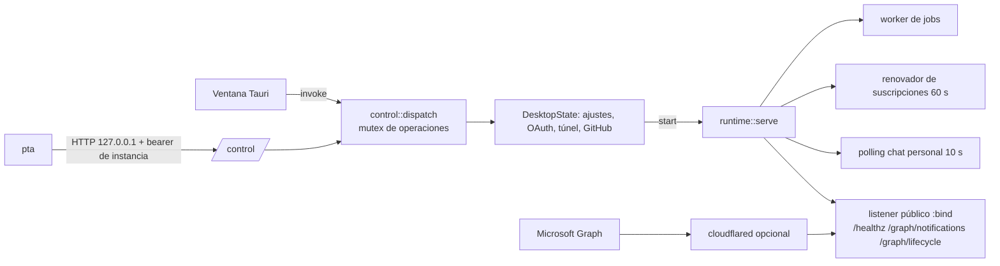
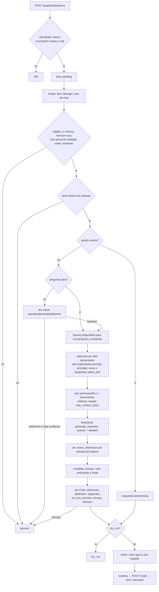

# Arquitectura

Referencia técnica para agentes de código. Describe cómo está construido el sistema, por dónde fluye un mensaje y qué invariantes no se pueden romper. El manual operativo (comandos `pta`) es la [skill incorporada](../desktop/src-tauri/skills/personal-teams-assistant/SKILL.md).

## 1. Qué es

Asistente personal de Microsoft Teams que responde **con la identidad del propio usuario** (OAuth delegado, sin bot). Recibe mensajes por webhooks de Microsoft Graph, decide si corresponde intervenir, recupera evidencia solo de fuentes autorizadas para esa conversación, redacta con DeepSeek, valida con Jev (TypeSafe) y envía una sola vez. Ante duda, no envía: la respuesta queda para la persona.

Se distribuye exclusivamente por Cargo. Un paquete (`personal-teams-desktop`) instala tres piezas:

| Pieza | Binario / ruta | Rol |
| --- | --- | --- |
| GUI + host | `personal-teams-desktop` | App Tauri de bandeja/barra de menús. Es el **único dueño** del perfil, las credenciales y el servicio Teams. Puede correr oculta (`--host`) o **sin interfaz** (`--headless`, o compilada sin la feature `gui` para Linux/servidores). |
| CLI | `pta` | Cliente administrativo. Habla con el host por IPC loopback autenticado; lo arranca oculto si no existe. |
| Skill | `desktop/src-tauri/skills/personal-teams-assistant/` | Manual para agentes, compilado dentro de `pta` (`pta skill show/path/install`). |

## 2. Estructura del repositorio

```text
Cargo.toml                    workspace + crate núcleo `personal-teams-assistant` (solo biblioteca)
src/                          núcleo: pipeline, adaptadores Graph, Jev, LLM, conocimiento, herramientas, SQLite
tests/integration.rs          integración con wiremock (Graph, Jev, DeepSeek simulados)
examples/wiki_gate_smoke.rs   regresión opcional contra Jev real con hechos sintéticos
desktop/src-tauri/            crate `personal-teams-desktop` (GUI, host, CLI, skill)
  src/lib.rs                  host: Host/Shell, estado, arranque/parada, OAuth, túnel, ajustes, entrada `run`
  src/gui.rs                  shell Tauri (feature `gui`): ventana, bandeja, comando `command` del WebView
  src/headless.rs             shell sin interfaz: primer plano, SIGTERM/Ctrl-C, `--start`
  src/control.rs              rutas del perfil, canal IPC (contrato 1), despachador único de operaciones
  src/cli.rs                  `pta`: parseo, validación de argumentos, traducción a métodos IPC
  src/github.rs               GitHub App con Device Flow, clonado/sync sin token en URL/argv
  src/skill.rs                textos de la skill incorporados con include_str!
  ui/                         HTML/CSS/JS sin framework; llama a `control::command` vía invoke
  skills/                     skill operativa (fuente canónica)
config.example.toml           plantilla del perfil (`Config::desktop_template`)
knowledge-map.example.toml    ejemplo sintético del mapa de fuentes
scripts/export-public.py      exporta un snapshot sin historial privado (exige gitleaks)
.agents/skills/save-knowledge para guardar hechos en la base de conocimiento
```

## 3. Modelo de procesos



- **Host y shell.** `Host` = `DesktopState` (operaciones) + `Shell` (lo que puede hacer el proceso dueño: mostrar/ocultar ventana, abrir URL, salir). `gui::TauriShell` lo implementa con Tauri; `headless::HeadlessShell` responde `not_ready` a `app open/hide`, devuelve las URLs al llamador y termina el proceso con `app quit`. Ninguna operación depende de Tauri.
- **Un host por perfil.** `control.lock` (flock) prueba propiedad; `control.json` publica puerto, token aleatorio y `wiki_support`. Un descriptor sin lock es obsoleto. Nunca se señaliza un proceso por PID.
- **IPC.** `POST /control` en un puerto loopback efímero, bearer constante en tiempo, rechaza cualquier `Origin` (navegadores). Cuerpo máx. 1 MB, timeout de cliente 120 s.
- **Despachador único.** GUI y CLI pasan por `control::dispatch`, que serializa con `operations` y verifica `revision` (SHA-256 de config + mapa + túnel) para escrituras basadas en un snapshot. Mientras hay un login Microsoft/GitHub pendiente solo se permiten lecturas.
- **El CLI lanza el host** (`host_executable`: binario hermano o `host-path.txt`) con `--host` en su propio grupo de procesos y espera el descriptor. El host hereda el entorno de `pta` (credenciales `NAME`/`NAME_FILE`, `PTA_HEADLESS`).
- **Servicio.** `runtime::serve` corre como tarea Tokio dentro del host. `lib.rs::start` lo lanza, espera `ready` (60 s) y luego arranca `cloudflared` si corresponde. `stop` mata el túnel, envía `true` por el `watch` y espera 20 s antes de abortar. Cerrar el canal también cuenta como parada.

### Host sin interfaz (Linux y servidores)

```sh
cargo install personal-teams-desktop --no-default-features --locked   # sin Tauri/WebKit
personal-teams-desktop --headless --start                              # primer plano; `--start` inicia el servicio
```

- Sin la feature `gui` el binario siempre es headless; con ella, `--headless` o `PTA_HEADLESS=1` lo fuerzan. Mismo perfil, contrato y operaciones que la GUI; se opera solo con `pta`.
- Corre en primer plano: `pta app quit`, SIGTERM o Ctrl-C detienen servicio y túnel antes de salir. Un segundo host sobre el mismo perfil sale con código 1. Logs a stderr (sin ANSI fuera de una terminal), aptos para journald.
- `--start` intenta iniciar el servicio; si falla, el host sigue vivo para diagnosticar con `pta status/doctor/audit`.
- Login Microsoft remoto: `pta auth microsoft login --no-browser` devuelve la URL; tras autorizar en cualquier dispositivo, el navegador no podrá abrir `http://localhost:PUERTO/?code=…`; esa URL se pega en `pta auth microsoft finish --redirect 'URL'` y el host la reenvía a su propio listener loopback (`forward_microsoft_redirect`: mismo puerto pendiente, se rechaza al instante si el callback no la acepta). Alternativa: migrar un perfil existente con `pta config import` más `STATE_ENCRYPTION_KEY`.
- El servidor necesita igualmente una URL HTTPS estable hacia el listener (túnel Cloudflare con token) y no debe coexistir con otra instancia activa de la misma cuenta: duplicaría respuestas y provocaría bucles en el chat personal.

## 4. Perfil, datos y credenciales

**Esto es lo que mantiene la sesión del usuario: no cambiar nombres ni rutas.**

| Elemento | Ubicación |
| --- | --- |
| Perfil (identificador Tauri `dev.personalteams.assistant`) | macOS `~/Library/Application Support/dev.personalteams.assistant/`; Windows `%APPDATA%\dev.personalteams.assistant\`; Linux `${XDG_CONFIG_HOME:-~/.config}/dev.personalteams.assistant/` |
| Archivos del perfil | `config.toml`, `knowledge-map.toml`, `cloudflared-path.txt`, `control.json`, `control.lock`, `host-path.txt`, `settings-rollback.json` (journal transitorio), `skills/` |
| Directorio de datos | `config.server.data_dir` (se conserva el importado; puede estar fuera del perfil). En un perfil nuevo: el del perfil en macOS/Windows, `${XDG_DATA_HOME:-~/.local/share}/dev.personalteams.assistant/` en Linux |
| Datos | `assistant.db` (servicio), `desktop-chat.db` (chat local/simulación), `instance.lock`, `repositories/` (clones GitHub) |
| Credenciales | Llavero macOS / Credential Manager, servicio `personal-teams-assistant.default`, cuenta = nombre de la credencial. Linux: archivos `<perfil>/credentials/default/NOMBRE` (0600, directorio 0700) |

Resolución de un secreto (`security::secret`): `NAME_FILE` → variable `NAME` → almacén del sistema (Llavero/Credential Manager, o el almacén de archivos en Linux, configurado por `configure_credentials`). `secret_source` solo inspecciona metadatos (en macOS usa `/usr/bin/security find-generic-password` sin descifrar). Credenciales conocidas: `TYPESAFE_API_KEY`, `DEEPSEEK_API_KEY`, `GRAPH_WEBHOOK_SECRET` y `STATE_ENCRYPTION_KEY` (ambas se generan al primer arranque si faltan), `CLOUDFLARE_TUNNEL_TOKEN` (modo túnel con token), `GITHUB_OAUTH_TOKENS`, y las mapeadas en `[secrets]` (p. ej. `AZURE_DEVOPS_TOKEN`).

Invariantes:

- `STATE_ENCRYPTION_KEY` (base64 de 32 bytes) cifra los tokens OAuth en `vault` con AES-256-GCM-SIV (AAD `teams-oauth-v1`). No se puede reemplazar ni borrar mientras exista `assistant.db`; importar una clave distinta se rechaza (`validate_state_key`).
- Una base no se reutiliza con otro tenant/client/usuario (`protect_identity`).
- Escrituras del perfil: archivo temporal 0600 + rename atómico; `commit_settings` escribe un journal y lo revierte si falla; el siguiente host recupera un journal pendiente.
- Directorios 0700 / ACL de la cuenta en Windows.
- En Linux el almacén de archivos guarda los valores en claro (protegidos solo por permisos), junto a la base cuyos tokens cifra `STATE_ENCRYPTION_KEY`. En un servidor, preferir credenciales de systemd o un gestor de secretos montado vía `NAME_FILE`.

## 5. Configuración

`Config` (`src/config.rs`) y `KnowledgeMap` (`src/knowledge.rs`) usan `deny_unknown_fields`. **No quitar ni renombrar campos**: perfiles existentes (y hosts antiguos que comparten el perfil) dejarían de cargar. Añadir campos solo con `#[serde(default)]`.

| Sección | Campos relevantes |
| --- | --- |
| `server` | `bind` (debe ser loopback), `public_url` (origen HTTPS), `data_dir`, `cloudflare_tunnel` |
| `graph` | `tenant_id`, `client_id`, `user_id` (UUID; nil hasta el login), `discover_all_chats` o `allowed_chats`, `self_chat {id,user_id,enabled_at}`, `channels` (heredado, debe estar vacío) |
| `jev` | `model`, `final_threshold` (activo, 0.5–1). `follow_up_threshold`, `routing_threshold`, `evidence_threshold`: heredados, sin uso, se conservan por compatibilidad |
| `llm` | `provider` (solo `deepseek`), `model`, `style` |
| `policy` | `dry_run`, `greeting`, `max_context_chars` (256–32000), `max_answer_chars` (1–4000), `max_detailed_answer_chars` (≥ normal, ≤16000), `max_message_age_seconds` (30–3600), `sensitive_patterns`, `allowed_senders` |
| `secrets` | `"secret://..." = "NOMBRE_CREDENCIAL"` (allowlist de referencias; nunca valores) |

`validate_teams_setup` (host) exige además URL pública real, IDs reales y cuenta conectada antes de iniciar Teams. El chat local no lo necesita.

## 6. Pipeline de un mensaje

Entrada: webhook o polling → `Store.enqueue(resource)` → worker → `Pipeline::process` (`src/pipeline.rs`).



Detalles que importan al modificar:

1. **Elegibilidad** (`teams::IncomingMessage::eligible_in`): mensaje de usuario no borrado, no propio (salvo chat personal validado y posterior a `enabled_at`), ≤16 000 bytes, dentro de `max_message_age_seconds`, `allowed_senders` global, y en grupos solo con mención real por ID de Graph (nunca por texto `@nombre`).
2. **Intención.** Saludo exacto (`teams::greeting`) → saludo configurado. Pregunta clara (`question_request`: `?`/`¿` o prefijos interrogativos) → recuperación. Lo ambiguo va a Jev `Stage::Intent` (sin catálogo de fuentes; confianza ≥0.5) y solo si hay alguna fuente autorizada.
3. **Seguimientos.** `conversation_context` guarda el último intercambio por conversación (caduca a los 30 min): la pregunta ya resuelta y la respuesta **sin** la sección de fuentes (las URLs copiadas fallarían la verificación). «dame más detalles» y equivalentes reutilizan esa pregunta como consulta de herramienta. Con otro mensaje y alguna herramienta autorizada, `LlmProvider::standalone_request` reescribe la solicitud de forma autónoma (`question`) y extrae el tema a buscar (`topic`), p. ej. «¿cómo se invoca si quiero pagar 2 servicios?» → tema «Crear SPS». `question` decide la herramienta, elige pasajes y se guarda como pregunta del contexto; `topic` es la consulta de Search de la Wiki. Ambos se validan (longitud, sin control, `Redactor::clean`); si el proveedor falla o no aplica, se usa la solicitud literal. Solo da forma a la consulta dentro de fuentes ya autorizadas por código. El contexto anterior se pasa como referencia, nunca como evidencia; la solicitud actual manda.
4. **Fuentes.** `KnowledgeMap::available` exige `enabled`, `external_processing`, conversación exacta o `*`, y `allowed_senders` de la fuente. En simulación local se seleccionan IDs explícitos (siguen exigiendo `enabled` y `external_processing`) sin ampliar audiencias Teams. Todos los archivos/URLs autorizados se leen; las herramientas se limitan a **una por mensaje**:
   - pregunta con «wiki» o documental (`documentation_question`) → la Wiki si hay una sola;
   - pregunta de actividad (`status_question`) → `azure-devops-status` (ID fijo);
   - Wiki única y solo herramientas Wiki/actividad → Wiki;
   - una sola candidata → esa; varias → `LlmProvider::select_tool` con IDs cerrados (fallo = ninguna).
5. **Evidencia.** Redacción antes de recortar. Presupuesto `max_context_chars / nº fuentes`. Wiki y Azure devuelven JSON tipado (`ado::wiki::WikiResult`, `evidence::Evidence`) con un registro de referencias (ID, URL verificada, autoría) y mensajes Teams con autor; el resto se recorta con `knowledge::excerpt`.
6. **Generación.** `DeepSeek::generate_response` devuelve JSON `{answer, detailed}`; el modelo elige el modo. `answer` es Markdown acotado (frase inicial directa, **negritas**, listas `-`/`1.`, `código`, bloques ```json), sin URLs ni sección de fuentes; los ejemplos usan marcadores (`<URL_BASE>`, `<RUT_TRAMITADOR>`) para no chocar con la verificación de URLs ni con el `Redactor`. Se reserva espacio para citas (`citation_reserve`). Sin herramientas autónomas, temperatura 0, timeout 45 s.
7. **Referencias.** Si hay registro, Jev decide por entrada (`source_i`) qué referencias usa el texto; el código las mapea a IDs exactos y `evidence::complete_answer` añade al final una sección `**Fuentes**` con una viñeta por referencia (`[título de la página](url): wiki del proyecto P; atribución`) y comprueba el límite **con las citas incluidas**. Un ID inventado o faltante bloquea (`invalid_references`).
8. **Control final.** Jev `Stage::Final` con varias comprobaciones `noul`; la confianza es el mínimo y debe superar `final_threshold`. Cuando solo hay Wiki (sin Teams) se omite `attribution` porque la atribución la construye el código.
9. **Envío.** `teams::html` convierte el Markdown en HTML de Teams (texto escapado; solo enlaces `https` como `<a>`, bloques como `<codeblock>`); todos los chats se envían con `contentType: html` y el chat personal añade su marca de salida. `valid_answer` exige además que el HTML quepa en el límite de Graph (27 800 bytes) antes de `sending`. Releer el mensaje; persistir `sending` con `synchronous=FULL` antes del POST; nunca reintentar un envío. Fallo o reinicio durante el envío = `uncertain` (revisión manual).

Estados de `jobs`: `pending → processing → ignored | dry_run | failed | sending → sent | uncertain`. Lecturas/proveedores fallidos reintentan con backoff 2^n s hasta 5 intentos. Al abrir la base, `processing` vuelve a `pending` y `sending` pasa a `uncertain`. La auditoría (`jobs.audit`, JSON redactado) guarda motivo, fuentes, herramientas, confianzas, referencias y propuesta; `pta audit` la consulta.

Motivos frecuentes: `ineligible_message`, `sensitive_question`, `no_authorized_resource`, `informational_message`, `deterministic_greeting`, `unsafe_proposal`, `reference_selection_failed`, `invalid_references: …`, `final_gate`, `supported_answer`, `message_changed`, `send_result_unknown_manual_review`.

## 7. Microsoft Graph y Entra

- **OAuth** (`adapters/oauth.rs`): cliente público, navegador del sistema, PKCE S256, redirect `http://localhost:<puerto>/` servido por el host durante el login (600 s). Scopes fijos `offline_access User.Read Chat.Read ChatMessage.Send` (`Config::scopes`). Se verifica `/me` contra `graph.user_id` antes de guardar tokens. El refresh se serializa y cada token rotado se persiste cifrado antes de usarse.
- **Registro Entra:** plataforma *Mobile and desktop* con `http://localhost`, cuentas multi-organización, solo permisos delegados. No añadir scopes: cambiaría el consentimiento ya concedido.
- **Suscripciones** (`Graph::reconcile_subscriptions`, cada 60 s): `discover_all_chats` → un recurso `users/{id}/chats/getAllMessages`; si no, `chats/{id}/messages` por chat de `allowed_chats`; más el chat personal. Duración 50 min, renovación con <10 min. Se recuperan suscripciones propias por callback exacto y `applicationId` (Graph oculta `clientState`). Lifecycle: `subscriptionRemoved`, `reauthorizationRequired`, `missed` (encola recuperación de la página reciente).
- **Webhook** (`adapters/webhook.rs`): valida todo el lote antes de encolar (clientState en tiempo constante, tenant, suscripción persistida, colección permitida, ruta canónica `chats/{id}/messages/{id}`). No sigue URLs de la notificación. Responde 202.
- **Chat personal**: `48:notes` (notas) o un oneOnOne cuyo único miembro es el usuario; validado por `validate_self_chat`. Recepción por webhook + polling de 50 mensajes cada 10 s. Cada salida lleva un enlace `https://personalteams.invalid/output/{nonce}` registrado en `outputs` antes de enviar, para reconocer ecos y envíos ambiguos tras reinicio. Una salida sin ID pausa el chat personal hasta `pta self-chat reconcile`.

## 8. Conocimiento y herramientas

`KnowledgeMap` = `repositories` (alias → checkout Git local) + `resources` (máx. 250). Cada recurso: `id`, `description`, `topics`, `enabled`, `external_processing`, `allowed_conversations`, `allowed_senders` y un acceso:

| `kind` | Reglas |
| --- | --- |
| `file` | Ruta relativa dentro de un checkout declarado, sin `..` ni symlinks que escapen; Markdown/TXT/JSON/TOML/YAML; ≤1 MB. |
| `url` | HTTPS exacta, puerto 443, sin credenciales; DNS resuelto y fijado, IP privadas rechazadas, sin redirects. |
| `tool` | `ToolSpec` (`src/tools.rs`), siempre de solo lectura y con `secret_ref` allowlisteado en `[secrets]`. |

| `ToolSpec` (`type`) | Nombre en auditoría | Qué hace | Timeout |
| --- | --- | --- | --- |
| `azure_devops_status` | `get_azure_devops_status` | Actividad reciente (7/14 días): work items, commits propios, pipelines/stages, releases, contexto Teams pertinente. Catálogo TOML (`organization`, `projects`, `author_email`) en el repo de conocimiento; índice de repos en `activity_cache` (activos 5 min, inactivos 6 h). | 180 s |
| `azure_devops_wiki` | `search_azure_devops_wiki` | Search nativo + Pages + autoría por Git (`created_by_me`/`edited_by_me`/`other`/`unknown`). `wiki_ids`, `author_mode` (`prefer_mine`, `mine_only`, `all`). Límites: Search 25 por página/100 candidatos, 10 historiales, 4 páginas de contexto, 1 MB, 8 s por petición, 30 s total. Requiere PAT con `vso.wiki` (+ `vso.code` para autoría). | 32 s |
| `azure_devops` | `get_work_item` | Un work item por `id: N`. | 5 s |
| `sql_server` | `get_payment_status` … | Tres consultas parametrizadas fijas sobre vistas `assistant_readonly.*`; sin SQL dinámico; TLS verificado. | 5 s |
| `rabbitmq` | `get_queue_status` | Metadatos de una cola (`/api/queues/...`). | 5 s |
| `http` | `http_get` | GET a URL fija, bearer opcional, ≤64 KB. | 5 s |

Reglas de respuesta (también en `AGENTS.md`): documentación Wiki propia puede respaldar con autoridad; de terceros, indicar ubicación y autor verificado (o autor desconocido); toda respuesta con Wiki enlaza sus páginas; work items, pipelines y stages concretos llevan enlace verificado (ejecución ≠ configuración); con mensajes Teams, nombrar interlocutores relevantes preservando quién dijo qué.

## 9. Seguridad transversal

- Toda decisión de modelo es consultiva: audiencias, rutas, URLs, herramientas y límites se verifican en código. Pregunta, documentos y resultados se presentan a los modelos como datos no confiables.
- `security::Redactor`: secretos cargados (coincidencia exacta), tokens/JWT/claves, credenciales en URL, correos, teléfonos, RUT, `secret://` y `sensitive_patterns`. Se aplica a pregunta, evidencia, propuesta y auditoría; una propuesta con patrones sensibles se bloquea.
- Logs: solo eventos fijos propios (`tracing`, filtro `personal_teams_assistant=info,personal_teams_desktop=info`); no se registran prompts, cuerpos HTTP ni errores de proveedores. Los errores hacia GUI/CLI se traducen a mensajes saneados (`lib.rs::fail`, `cli.rs::run`).
- Clientes HTTP sin redirects; tamaños de respuesta acotados (`adapters::bounded_json`).
- WebView con CSP estricta (`connect-src 'none'`); solo `control::command` está expuesto a la UI.
- Git: clones gestionados con askpass (`PERSONAL_TEAMS_GIT_ASKPASS`), sin token en URL/argv; `sync` exige checkout limpio y fast-forward.

## 10. CLI: contrato 1

`pta [--json] [--non-interactive] COMANDO`. `--json` imprime `{contract, version, ok, code, exit_code, message, data, revision}`. Progreso a stderr, sin streaming. Credenciales solo por stdin no interactivo (≤16 KiB). `pta --help` es la referencia de comandos.

| Exit | Código | Significado |
| --- | --- | --- |
| 0 | `ok` | Concluida |
| 1 | `operation_failed` | Falló; inspeccionar estado antes de repetir |
| 2 | `invalid_input` | Entrada/validación |
| 3 | `not_ready` | Falta configuración o conexión |
| 4 | `authorization_pending` | Requiere una acción humana (OAuth) |
| 5 | `dependency_or_network` | Red, proveedor o instalación |
| 6 | `state_conflict` / `revision_conflict` / `contract_mismatch` | Revisión, contrato o versión incompatible |

Para añadir una operación: método en `control::operate` (ventana o navegador solo a través de `host.shell`, para que funcione sin interfaz) (y en las listas permitidas durante login si es de lectura) → comando en `cli.rs` (`HELP`, `validate_args`, mapeo) → si cambia el esquema que un host antiguo no entiende, anunciarlo en `Endpoint` como `wiki_support` → documentar en la skill.

## 11. GUI

`ui/` es HTML/JS plano sin build. Tres pestañas: Configuración (servicio, credenciales, proveedores/Teams, chat personal, importación), Conocimiento (repositorios, GitHub, fuentes) y Chat de prueba. Todo pasa por `invoke('command', {request})` con los mismos métodos que el CLI. Desfase conocido: la GUI solo lista y crea fuentes `kind=file`; Wiki y otras herramientas se administran por CLI. El chat de prueba muestra la respuesta como Markdown sin convertir (Teams la recibe en HTML).

## 12. Pruebas y verificación

```sh
cargo fmt --all --check
cargo clippy --workspace --all-targets -- -D warnings
cargo test --workspace
```

- Unitarias junto al código; integración en `tests/integration.rs` con `wiremock` y dobles (`NoGate`, `NoLlm`, `NoTools`, `IntentGate`…). Ninguna prueba usa red ni credenciales reales.
- `pta test simulate` / `pta chat` ejecutan el pipeline real con un adaptador que nunca envía a Graph (`simulation::TestAdapter`, estado `sent` = `simulation-only`). `pta test providers` usa hechos sintéticos y consume API.
- `cargo run --example wiki_gate_smoke` (credencial Jev existente) evalúa el control final con hechos sintéticos.
- CI (`.github/workflows/ci.yml`): núcleo en Ubuntu; host sin interfaz y CLI en Ubuntu con `--no-default-features` (clippy, test); GUI/CLI en macOS (check, clippy, test) y Windows (check).
- Toda operación nueva debe compilar en ambas variantes: `cargo clippy -p personal-teams-desktop --all-targets [--no-default-features] -- -D warnings`. El código de Tauri solo vive en `gui.rs`.

## 13. Recetas de cambio

- **Nuevo tipo de herramienta:** variante en `ToolSpec` + `validate` + `name` + rama en `Tools::execute` (con timeout) → si devuelve evidencia tipada, deserializarla en el pipeline y registrar referencias → pruebas con wiremock → documentar el esquema en la skill y en `knowledge-map.example.toml`.
- **Nuevo proveedor LLM:** implementar `LlmProvider` (`generate_response` con JSON `{answer, detailed}`, `select_tool` opcional), añadirlo a `validate_provider` y construirlo en `runtime::serve`, `local_chat::chat` y `diagnostics::providers`.
- **Cambiar decisiones de Jev:** `decision.rs` (`Stage::Intent`, `Stage::Final`, `select_references`). Los contratos rechazan campos ausentes/extra y probabilidades inválidas; mantener el fallo cerrado.
- **Campo de configuración nuevo:** `#[serde(default)]`, validación en `Config::validate`, exposición en GUI si aplica; `pta config set` lo admite automáticamente por ruta.

## 14. Decisiones vigentes y su porqué

- **Jev no veta la recuperación.** Antes un selector Jev decidía la fuente antes de leerla; en una muestra real (2026-10-01) rechazó la mitad de las preguntas documentales con confianza 0.29–0.38 y la Wiki nunca se consultó. Ahora Jev solo clasifica intención ambigua, selecciona referencias después de redactar y valida la respuesta final. No reintroducir un filtro previo por tema o pertinencia.
- **La atribución Wiki la construye el código** desde metadatos verificados; la comprobación probabilística `attribution` se omite cuando no hay mensajes Teams porque producía falsos rechazos (p. ej. `edited_by_me` con `author=null`). `supported` sigue rechazando autorías o ejecuciones inventadas.
- **El modelo no copia IDs ni URLs.** DeepSeek devuelve solo texto y modo; las citas salen del registro verificado.
- **El formato se decide en código.** El modelo escribe Markdown acotado y el código lo convierte a HTML de Teams; la sección de fuentes se construye desde el registro. Antes, la respuesta se escapaba como texto y Teams mostraba `[etiqueta](url)` literal.
- **Los seguimientos se resuelven antes de buscar, no se vetan.** Buscar solo las palabras de «¿y si quiero pagar 2 servicios?» no encontraba la página y el control final rechazaba la respuesta en silencio. La reescritura autónoma solo cambia la consulta; la selección de herramientas y las audiencias siguen en código.
- **Una herramienta por mensaje**, para acotar coste, latencia y superficie; combinar fuentes es una mejora pendiente.
- **Ningún envío se reintenta**: Graph no ofrece idempotencia; se prefiere omitir una respuesta antes que duplicarla.
- **OAuth público de escritorio con los scopes ya concedidos**; el registro Entra existente admite `http://localhost` y otras organizaciones. Pedir nuevos permisos obligaría a un consentimiento nuevo.
- **Solo Cargo**: sin bundles firmados/notarizados ni servidor Docker; el host (con GUI o sin interfaz) es el único runtime.

## 15. Límites conocidos

- Una identidad Teams por perfil. Canales de equipo no soportados.
- La recepción exige equipo encendido y una URL HTTPS estable hasta el listener (túnel Cloudflare con token, archivo `cloudflared` propio o túnel externo).
- Una sola herramienta por respuesta (no combina Wiki y actividad).
- El chat de prueba de la GUI muestra el Markdown de la respuesta sin convertir; `pta chat` también lo devuelve como texto.
- La recuperación de `missed` cubre solo la página reciente; no hay garantía de procesar mensajes durante apagones.
- No detecta si el usuario respondió manualmente mientras se generaba la propuesta.
- Windows compila en CI pero no tiene validación funcional. Linux solo como host sin interfaz (la GUI en Linux no se prueba).
- La versión publicada en crates.io puede ir por detrás del repositorio; GUI y CLI deben ser de la misma compilación (el CLI rechaza esquemas Wiki contra un host sin `wiki_support`).
