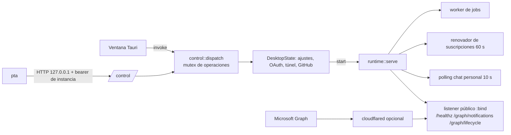
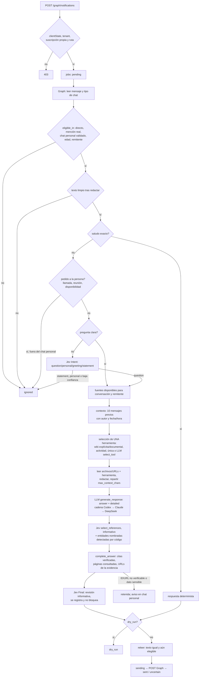

# Arquitectura

Referencia técnica para agentes de código. Describe cómo está construido el sistema, por dónde fluye un mensaje y qué invariantes no se pueden romper. El manual operativo (comandos `pta`) es la [skill incorporada](../desktop/skills/personal-teams-assistant/SKILL.md).

## 1. Qué es

Asistente personal de Microsoft Teams que responde **con la identidad del propio usuario** (OAuth delegado, sin bot). Recibe mensajes por webhooks de Microsoft Graph, decide si corresponde intervenir, recupera evidencia solo de fuentes autorizadas para esa conversación, redacta con un modelo de lenguaje (Codex o Claude Code mediante su CLI instalada, o la API de DeepSeek, en una cadena de respaldo), verifica en código referencias, URLs y datos sensibles, registra una revisión informativa de Jev (TypeSafe) y envía una sola vez. Si un control de código la retiene, no envía: la respuesta queda para la persona (y en el chat personal se le avisa).

Se distribuye exclusivamente por Cargo. Un solo paquete, `personal-teams-assistant`, instala tres piezas (hasta 0.4.0 la app venía en un paquete aparte, `personal-teams-desktop`, ya obsoleto):

| Pieza | Binario / ruta | Rol |
| --- | --- | --- |
| GUI + host | `personal-teams-assistant` | App Tauri de bandeja/barra de menús. Es el **único dueño** del perfil, las credenciales y el servicio Teams. Puede correr oculta (`--host`) o **sin interfaz** (`--headless`, o compilada sin la feature `gui` para Linux/servidores). |
| CLI | `pta` | Cliente administrativo. Habla con el host por IPC loopback autenticado; lo arranca oculto si no existe. |
| Skill | `desktop/skills/personal-teams-assistant/` | Manual para agentes, compilado dentro de `pta` (`pta skill show/path/install`). |

## 2. Estructura del repositorio

```text
Cargo.toml                    paquete único `personal-teams-assistant`: biblioteca + binarios
                              `personal-teams-assistant` (GUI/host) y `pta`; feature `gui` (Tauri)
build.rs                      tauri-build desde `desktop/` (solo con `gui`), en OUT_DIR
src/                          núcleo: pipeline, adaptadores Graph, Jev, LLM, conocimiento, herramientas, SQLite
  llm.rs                      contrato LlmProvider, prompts (`Model`), cadena de respaldo (`Chain`), validación
  llm/deepseek.rs             API DeepSeek (`/chat/completions`)
  llm/agent.rs                Codex (`codex exec`) y Claude Code (`claude -p`) como CLI sin herramientas; catálogo
  app.rs                      host: Host/Shell, estado, arranque/parada, OAuth, túnel, ajustes, entrada `run`
  app/gui.rs                  shell Tauri (feature `gui`): ventana, bandeja, comando `command` del WebView
  app/headless.rs             shell sin interfaz: primer plano, SIGTERM/Ctrl-C, `--start`
  app/control.rs              rutas del perfil, canal IPC (contrato 1), despachador único, actualización
  app/cli.rs                  `pta`: ayuda, parseo, validación de argumentos, traducción a métodos IPC
  app/github.rs               GitHub App con Device Flow, clonado/sync sin token en URL/argv
  app/skill.rs                textos de la skill incorporados con include_str!
  main.rs, bin/pta.rs         binarios (`app::run`, `app::cli::run`)
desktop/                      recursos de la app: tauri.conf.json, Info.plist, capabilities/, icons/
  ui/                         HTML/CSS/JS sin framework; llama a `control::command` vía invoke
  skills/                     skill operativa (fuente canónica)
site/                         landing estática fuera del paquete de Cargo: `public/` (HTML y CSS sin
                              JavaScript ni build, `_headers`, `404.html`, capturas de la GUI con
                              datos sintéticos) y `wrangler.jsonc` (Cloudflare Workers, solo assets)
tests/integration.rs          integración con wiremock (Graph, Jev, DeepSeek simulados)
examples/wiki_gate_smoke.rs   regresión opcional contra Jev real con hechos sintéticos
config.example.toml           plantilla del perfil (`Config::desktop_template`)
knowledge-map.example.toml    ejemplo sintético del mapa de fuentes
scripts/export-public.py      exporta un snapshot sin historial privado (exige gitleaks)
.agents/skills/save-knowledge para guardar hechos en la base de conocimiento
```

## 3. Modelo de procesos



- **Host y shell.** `Host` = `DesktopState` (operaciones) + `Shell` (lo que puede hacer el proceso dueño: mostrar/ocultar ventana, abrir URL, salir). `gui::TauriShell` lo implementa con Tauri; `headless::HeadlessShell` responde `not_ready` a `app open/hide`, devuelve las URLs al llamador y termina el proceso con `app quit`. Ninguna operación depende de Tauri.
- **Un host por perfil.** `control.lock` (flock) prueba propiedad; `control.json` publica puerto, token aleatorio y `wiki_support`. Un descriptor sin lock es obsoleto. Nunca se señaliza un proceso por PID.
- **IPC.** `POST /control` en un puerto loopback efímero, bearer constante en tiempo, rechaza cualquier `Origin` (navegadores). Cuerpo máx. 1 MB, timeout de cliente 120 s (sin límite para `chat` y `test_providers`, que esperan al modelo).
- **Despachador único.** GUI y CLI pasan por `control::dispatch`, que serializa con `operations` y verifica `revision` (SHA-256 de config + mapa + túnel) para escrituras basadas en un snapshot. Mientras hay un login Microsoft/GitHub pendiente solo se permiten lecturas.
- **Actualización.** `cargo install` no ejecuta nada al terminar y reemplaza el archivo mientras el host anterior sigue corriendo. `control.json` publica `binary` (tamaño y fecha del ejecutable al arrancar; los hosts anteriores no lo tienen). Si el host que corre se lanzó desde la **misma ruta** instalada y su huella ya no coincide, está desactualizado (`control::outdated_host`): el primer `pta` (salvo `capabilities`, `skill` y `doctor --offline`) o la app nueva lo retiran (`retire_outdated_host`: lee si el asistente corría, envía `app_quit` —que detiene asistente y túnel— y espera a que libere el lock, 60 s). Si corría, `pta` pregunta en la terminal si dejarlo corriendo con la versión nueva (sin terminal, `--json` o `--non-interactive` conserva el estado); la GUI nueva muestra el aviso `restart_offer` (`start_assistant` o `dismiss_restart_offer`); el host sin interfaz pregunta si hay terminal o conserva el estado. `start`, `restart`, `stop` y `app quit` deciden el estado por sí mismos. Un host lanzado desde otra ruta (p. ej. una compilación de desarrollo) nunca se retira así.
- **El CLI lanza el host** (`host_executable`: binario hermano o `host-path.txt`) con `--host` en su propio grupo de procesos y espera el descriptor. El host hereda el entorno de `pta` (credenciales `NAME`/`NAME_FILE`, `PTA_HEADLESS`).
- **Servicio.** `runtime::serve` corre como tarea Tokio dentro del host. `app.rs::start` lo lanza, espera `ready` (60 s) y luego arranca `cloudflared` si corresponde. `stop` mata el túnel, envía `true` por el `watch` y espera 20 s antes de abortar. Cerrar el canal también cuenta como parada.

### Host sin interfaz (Linux y servidores)

```sh
cargo install personal-teams-assistant --no-default-features --locked   # sin Tauri/WebKit
personal-teams-assistant --headless --start                              # primer plano; `--start` inicia el servicio
```

- Sin la feature `gui` el binario siempre es headless; con ella, `--headless` o `PTA_HEADLESS=1` lo fuerzan. Mismo perfil, contrato y operaciones que la GUI; se opera solo con `pta`.
- Corre en primer plano: `pta app quit`, SIGTERM o Ctrl-C detienen servicio y túnel antes de salir. Un segundo host sobre el mismo perfil sale con código 1. Logs a stderr (sin ANSI fuera de una terminal), aptos para journald.
- `--start` intenta iniciar el servicio; si falla, el host sigue vivo para diagnosticar con `pta status/doctor/audit`.
- Login Microsoft remoto: `pta auth microsoft login --no-browser` devuelve la URL; tras autorizar en cualquier dispositivo, el navegador no podrá abrir `http://localhost:PUERTO/?code=…`; esa URL se pega en `pta auth microsoft finish --redirect 'URL'` y el host la reenvía a su propio listener loopback (`forward_microsoft_redirect`: mismo puerto pendiente, se rechaza al instante si el callback no la acepta). Alternativa: migrar un perfil existente con `pta config import` más `STATE_ENCRYPTION_KEY`.
- El servidor necesita igualmente una URL HTTPS estable hacia el listener (túnel Cloudflare con token) y no debe coexistir con otra instancia activa de la misma cuenta: duplicaría respuestas y provocaría bucles en el chat personal.

## 4. Perfil, datos y credenciales

**Esto es lo que mantiene la sesión del usuario: no cambiar nombres ni rutas.**

| Elemento | Ubicación |
| --- | --- |
| Perfil (identificador Tauri `dev.personalteams.assistant`) | macOS `~/Library/Application Support/dev.personalteams.assistant/`; Windows `%APPDATA%\dev.personalteams.assistant\`; Linux `${XDG_CONFIG_HOME:-~/.config}/dev.personalteams.assistant/` |
| Archivos del perfil | `config.toml`, `knowledge-map.toml`, `cloudflared-path.txt`, `control.json`, `control.lock`, `host-path.txt`, `settings-rollback.json` (journal transitorio), `skills/` |
| Directorio de datos | `config.server.data_dir` (se conserva el importado; puede estar fuera del perfil). En un perfil nuevo: el del perfil en macOS/Windows, `${XDG_DATA_HOME:-~/.local/share}/dev.personalteams.assistant/` en Linux |
| Datos | `assistant.db` (servicio), `desktop-chat.db` (chat local/simulación), `instance.lock`, `repositories/` (clones GitHub) |
| Credenciales | Llavero macOS / Credential Manager, servicio `personal-teams-assistant.default`, cuenta = nombre de la credencial. Linux: archivos `<perfil>/credentials/default/NOMBRE` (0600, directorio 0700) |

Resolución de un secreto (`security::secret`): `NAME_FILE` → variable `NAME` → almacén del sistema (Llavero/Credential Manager, o el almacén de archivos en Linux, configurado por `configure_credentials`). `secret_source` solo inspecciona metadatos (en macOS usa `/usr/bin/security find-generic-password` sin descifrar). Credenciales conocidas: `TYPESAFE_API_KEY`, `DEEPSEEK_API_KEY` (exigida al iniciar solo si DeepSeek está activo en `llm.chain`; si no, `credentials list` la muestra como `unused`), `GRAPH_WEBHOOK_SECRET` y `STATE_ENCRYPTION_KEY` (ambas se generan al primer arranque si faltan), `CLOUDFLARE_TUNNEL_TOKEN` (modo túnel con token), `GITHUB_OAUTH_TOKENS`, y las mapeadas en `[secrets]` (p. ej. `AZURE_DEVOPS_TOKEN`).

Invariantes:

- `STATE_ENCRYPTION_KEY` (base64 de 32 bytes) cifra los tokens OAuth en `vault` con AES-256-GCM-SIV (AAD `teams-oauth-v1`). No se puede reemplazar ni borrar mientras exista `assistant.db`; importar una clave distinta se rechaza (`validate_state_key`).
- Una base no se reutiliza con otro tenant/client/usuario (`protect_identity`).
- Escrituras del perfil: archivo temporal 0600 + rename atómico; `commit_settings` escribe un journal y lo revierte si falla; el siguiente host recupera un journal pendiente.
- Directorios 0700 / ACL de la cuenta en Windows.
- En Linux el almacén de archivos guarda los valores en claro (protegidos solo por permisos), junto a la base cuyos tokens cifra `STATE_ENCRYPTION_KEY`. En un servidor, preferir credenciales de systemd o un gestor de secretos montado vía `NAME_FILE`.

## 5. Configuración

`Config` (`src/config.rs`) y `KnowledgeMap` (`src/knowledge.rs`) usan `deny_unknown_fields`. **No quitar ni renombrar campos**: perfiles existentes (y hosts antiguos que comparten el perfil) dejarían de cargar. Añadir campos solo con `#[serde(default)]`.

| Sección | Campos relevantes |
| --- | --- |
| `server` | `bind` (debe ser loopback), `public_url` (origen HTTPS), `data_dir`, `cloudflare_tunnel` |
| `graph` | `tenant_id`, `client_id`, `user_id` (UUID; nil hasta el login), `discover_all_chats` o `allowed_chats`, `self_chat {id,user_id,enabled_at}`, `channels` (heredado, debe estar vacío) |
| `jev` | `model`, `final_threshold` (activo, 0.5–1). `follow_up_threshold`, `routing_threshold`, `evidence_threshold`: heredados, sin uso, se conservan por compatibilidad |
| `llm` | `style`; `language` (`es` por defecto o `en`: idioma de todo lo que se envía a Teams, prevalece sobre el estilo); `chain`: lista ordenada `{provider, model, effort, enabled}` (`codex`, `claude`, `deepseek`; uno de cada uno, al menos uno activo). `provider`/`model` heredados: solo rigen con `chain` vacío (DeepSeek, esfuerzo `max`) |
| `policy` | `dry_run`, `greeting`, `max_context_chars` (256–32000), `max_message_age_seconds` (30–3600), `sensitive_patterns`, `allowed_senders`; `max_answer_chars` y `max_detailed_answer_chars` se conservan por compatibilidad pero ya no se aplican |
| `secrets` | `"secret://..." = "NOMBRE_CREDENCIAL"` (allowlist de referencias; nunca valores) |

`validate_teams_setup` (host) exige además URL pública real, IDs reales y cuenta conectada antes de iniciar Teams. El chat local no lo necesita.

## 6. Pipeline de un mensaje

Entrada: webhook o polling → `Store.enqueue(resource)` → worker → `Pipeline::process` (`src/pipeline.rs`).



Detalles que importan al modificar:

1. **Elegibilidad** (`teams::IncomingMessage::eligible_in`): mensaje de usuario no borrado, no propio (salvo chat personal validado y posterior a `enabled_at`), ≤16 000 bytes, dentro de `max_message_age_seconds`, `allowed_senders` global, y en grupos solo con mención real por ID de Graph (nunca por texto `@nombre`).
2. **Intención.** Saludo exacto (`teams::greeting`) → saludo configurado. Pedido a la persona (`personal_request`: llamarla, reunirse, revisar algo en conjunto o su disponibilidad, p. ej. «te puedo llamar», «necesito llamarte», «revisemos…», «¿tienes un minuto?») → sin respuesta (`personal_request`), aunque lleve `?`. Pregunta clara (`question_request`: `?`/`¿` o prefijos interrogativos; «necesito que…» y «cuando puedas…» no cuentan porque piden a alguien que actúe) → recuperación. Lo ambiguo va a Jev `Stage::Intent` (`question`, `personal`, `greeting`, `statement`; sin catálogo de fuentes; confianza ≥0.5) y solo si hay alguna fuente autorizada; solo `question` y `greeting` se responden. En el chat personal quien pide es el propio usuario: ahí no se aplica el filtro de pedidos a la persona y `personal` se trata como pregunta.
3. **Contexto y seguimientos.** `MessageAdapter::history` lee los `HISTORY_MESSAGES` (10) mensajes anteriores de la misma conversación (Graph: página reciente de `chats/{id}/messages` por `createdDateTime desc`; excluye borrados, eventos de sistema y los posteriores al actual). Cada uno lleva autor (`yo`, `asistente` si es una salida registrada de la app, o el nombre visible) y fecha/hora local; se redacta, se acota a 6000 caracteres (se conservan los más recientes) y termina con la hora de la solicitud actual. Se entrega como `conversation_history` a `standalone_request` y a `generate_response`: sirve para interpretar la solicitud, nunca como evidencia. Si Graph falla, se sigue sin historial (`conversation_history_unavailable`). Además, `conversation_context` guarda el último intercambio por conversación (caduca a los 30 min): la pregunta ya resuelta y la respuesta **sin** la sección de fuentes (las URLs copiadas fallarían la verificación). «dame más detalles» y equivalentes reutilizan esa pregunta como consulta de herramienta. Con otro mensaje, alguna herramienta autorizada y contexto (historial o último intercambio), `LlmProvider::standalone_request` reescribe la solicitud de forma autónoma (`question`) y extrae el tema a buscar (`topic`), p. ej. «¿cómo se invoca si quiero pagar 2 servicios?» → tema «Crear SPS». `question` decide la herramienta, elige pasajes y se guarda como pregunta del contexto; `topic` es la consulta de Search de la Wiki. Ambos se validan (longitud, sin control, `Redactor::clean`); si el proveedor falla o no aplica, se usa la solicitud literal. Solo da forma a la consulta dentro de fuentes ya autorizadas por código. El contexto anterior se pasa como referencia, nunca como evidencia; la solicitud actual manda.
4. **Fuentes.** `KnowledgeMap::available` exige `enabled`, `external_processing`, conversación exacta o `*`, y `allowed_senders` de la fuente. En simulación local se seleccionan IDs explícitos (siguen exigiendo `enabled` y `external_processing`) sin ampliar audiencias Teams. Todos los archivos/URLs autorizados se leen; las herramientas se limitan a **una por mensaje**:
   - pregunta con «wiki» o documental (`documentation_question`) → la Wiki si hay una sola;
   - pregunta de actividad (`status_question`) → `azure-devops-status` (ID fijo);
   - Wiki única y solo herramientas Wiki/actividad → Wiki;
   - una sola candidata → esa; varias → `LlmProvider::select_tool` con IDs cerrados (fallo = ninguna).
5. **Evidencia.** Redacción antes de recortar. Presupuesto `max_context_chars / nº fuentes`. Wiki y Azure devuelven JSON tipado (`ado::wiki::WikiResult`, `evidence::Evidence`) con un registro de referencias (ID, URL verificada, autoría) y mensajes Teams con autor; el resto se recorta con `knowledge::excerpt`.
6. **Generación.** `LlmProvider::generate_response` devuelve JSON `{answer, detailed}`; el modelo elige el modo. `answer` es Markdown acotado (frase inicial directa, **negritas**, listas `-`/`1.`, `código`, bloques ```json), sin sección de fuentes ni enlaces a páginas Wiki. Una URL o endpoint solo se escribe si aparece literalmente en la evidencia (p. ej. la dirección de un ambiente documentada en la Wiki); si no está, el modelo lo dice y en ejemplos usa marcadores (`<URL_BASE>`, `<RUT_TRAMITADOR>`) para no chocar con la verificación de URLs ni con el `Redactor`. Sin límite de caracteres: solo se exige que el HTML quepa en un mensaje de Teams (27 800 bytes). Sin herramientas autónomas.

   **Proveedores y respaldo** (`src/llm.rs`). Los prompts y contratos viven en `Model` y son idénticos para todos; cada transporte implementa `Backend::complete_json(system, user, schema)`. `llm::from_config` construye una `Chain` con los proveedores activos de `llm.chain` en orden. **Cada llamada** (`standalone_request`, `select_tool`, `generate_response`) empieza por el primero y pasa al siguiente solo si falla; la siguiente llamada vuelve a empezar por el primero, así que el predeterminado retoma en cuanto recupera su uso. Los fallos llevan solo una clase (`usage_limit`, `not_installed`, `failed`; `llm::Unavailable`), nunca texto del proveedor, y se registran como `llm_provider_unavailable`/`llm_fallback_used`. `audit.provider` guarda `proveedor:modelo:esfuerzo` del que redactó. Respaldar es seguro porque solo repite una llamada al modelo; ningún envío a Graph se reintenta.

   - **DeepSeek** (`llm/deepseek.rs`): HTTP directo a `/chat/completions` (sin SDK), modo JSON, `reasoning_effort` configurado (`none` desactiva `thinking`), sin `max_tokens` ni temperatura y **sin plazo** (solo se acotan la conexión, 30 s, y keepalive TCP). 402/429 = `usage_limit`. Solo se usa `content`; `reasoning_content` se descarta y nunca se registra.
   - **Codex y Claude Code** (`llm/agent.rs`): la CLI instalada con **su propia sesión** (la app no guarda credenciales de OpenAI/Anthropic). Se localiza en `PATH` o en ubicaciones habituales (`~/.local/bin`, Homebrew…), porque una GUI abierta desde Finder tiene un PATH mínimo; se buscan en cada llamada, así que instalar una CLI no requiere reiniciar. Cada llamada corre en un directorio temporal privado y vacío, con entorno mínimo (`HOME`, `USER`, locale, proxy, `CODEX_HOME`/`CLAUDE_CONFIG_DIR`; **nunca** `NAME`/`NAME_FILE` del host), la solicitud y la evidencia por **stdin** (no en argv) y el esquema JSON del contrato. Codex: `codex exec --ephemeral --ignore-user-config --ignore-rules --sandbox read-only --json --output-schema`, instrucciones como `developer_instructions` y `-c features.X=false` para shell, exec/código, apps, plugins, navegador, computer use, subagentes, skills, memorias, hooks y búsqueda web (la forma `-c` tolera versiones que no conocen una feature); se usa el último `agent_message` de un turno `turn.completed`. Claude: `claude -p --output-format json --tools "" --safe-mode --strict-mcp-config --no-session-persistence --system-prompt --json-schema`; se usa `structured_output`, y `is_error` con HTTP 402/429 o texto de créditos/límite = `usage_limit`. Plazo de 20 min por llamada (las CLI reintentan por su cuenta); al vencer se mata el proceso y responde el siguiente.
   - **Catálogo** (`llm::catalog`, IPC `llm_providers`, `pta llm providers`): CLI detectadas y su versión; modelos de Codex desde `codex debug models` (visibles, sin el esfuerzo `ultra`, que delega en subagentes); Claude y DeepSeek con lista fija. Esfuerzos validados en `llm::efforts`; IDs de modelo con alfabeto cerrado y sin guion inicial porque llegan a argv.

   **Aviso de espera** (`Pipeline::awaiting_model`): si a los 5 min de empezar a procesar un mensaje de Teams el modelo sigue trabajando, se envía una vez el texto fijo `holding_reply` («Déjame revisarlo.» o «Let me look into it.», según `llm.language`) y se sigue esperando la respuesta. `audit.holding_reply` registra `sending` antes del POST y luego `sent` o `uncertain`; un reintento del job con ese campo nunca vuelve a enviarlo, y un fallo no se reintenta. No aplica a `dry_run` ni a simulaciones (`pta chat`). En el chat personal lleva la misma marca de salida, así que no se procesa como pregunta.
7. **Referencias.** Si hay registro, Jev sugiere por entrada (`source_i`) qué referencias usa el texto (`audit.reference_selection = jev`); si falla, no bloquea (`code`). A esa selección el código suma las entidades no Wiki que ve nombradas en el texto (`evidence::named_references`: alias o `#id`). `evidence::complete_answer` añade al final, en el idioma de `llm.language`, `**Fuentes**` (`**Sources**`) con una viñeta por referencia (`[título de la página](url): wiki del proyecto P; atribución`); si ninguna página Wiki quedó seleccionada, lista todas las consultadas bajo `**Páginas consultadas**` (`**Pages consulted**`), de modo que una respuesta basada en la Wiki siempre enlaza sus páginas. Las URLs del cuerpo deben ser referencias verificadas o aparecer literalmente en la evidencia. Siguen reteniendo la respuesta (en código): un ID inventado, una entidad concreta sin referencia verificada o una URL nueva (`invalid_references: …`), y los datos sensibles o el tamaño (`unsafe_proposal`/`unsafe_answer`). La propuesta retenida queda en `audit.proposed`.
8. **Revisión final de Jev (informativa).** Jev `Stage::Final` con varias comprobaciones `noul` (confianza = mínimo) se registra en `audit.final_check` (`allow 0.91`, `ignore 0.40` o `unavailable`) y en el registro de pasos, pero **no impide el envío**, tampoco si Jev falla. `final_threshold` solo decide si el registro la marca como aprobada o con observaciones. Cuando solo hay Wiki (sin Teams) se omite `attribution` porque la atribución la construye el código.

   **Respuesta retenida** (`Pipeline::withhold`): en el chat personal, fuera de `dry_run` y simulaciones, se envía una vez un texto fijo en el idioma de `llm.language` («No envié la respuesta a tu mensaje: <causa>…» / «I didn't send the reply to your message: …») sin el contenido retenido. `audit.withheld_notice` registra `sending` antes del POST y luego `sent`/`uncertain`; un reintento nunca lo repite. En chats con otras personas no se avisa.

   **Registro de cada mensaje.** `Audit` guarda, además, el texto redactado del mensaje elegible (`question`; nunca el de mensajes no elegibles), la solicitud interpretada y el tema buscado, el tipo de conversación, la hora del mensaje, el número de mensajes de contexto, el proveedor y los que fallaron antes (`provider_fallbacks`), y `trace`: pasos con hora y una explicación que no incluye contenido del mensaje. `Store::inspect` devuelve `created_at` y, sin `content`, omite `question`, `resolved_question`, `topic`, `proposed` y `sent`.
9. **Envío.** `teams::html` convierte el Markdown en HTML de Teams (texto escapado; solo enlaces `https` como `<a>`, bloques como `<codeblock>`); todos los chats se envían con `contentType: html` y el chat personal añade su marca de salida. `valid_answer` exige además que el HTML quepa en el límite de Graph (27 800 bytes) antes de `sending`. Releer el mensaje: texto igual y aún elegible, con la antigüedad medida al **empezar** a procesar (`max_message_age_seconds` + tiempo de proceso; sin límite si ya salió el aviso de espera); persistir `sending` con `synchronous=FULL` antes del POST; nunca reintentar un envío. Fallo o reinicio durante el envío = `uncertain` (revisión manual).

Estados de `jobs`: `pending → processing → ignored | dry_run | failed | sending → sent | uncertain`. Lecturas/proveedores fallidos reintentan con backoff 2^n s hasta 5 intentos. Al abrir la base, `processing` vuelve a `pending` y `sending` pasa a `uncertain`. La auditoría (`jobs.audit`, JSON redactado) guarda motivo, fuentes, herramientas, confianzas, referencias y propuesta; `pta audit` la consulta.

Motivos frecuentes: `ineligible_message`, `sensitive_question`, `no_authorized_resource`, `informational_message`, `personal_request`, `deterministic_greeting`, `unsafe_proposal`, `invalid_references: …`, `supported_answer`, `message_changed`, `send_result_unknown_manual_review`. `reference_selection_failed` y `final_gate` solo aparecen en auditorías anteriores a que Jev dejara de bloquear.

## 7. Microsoft Graph y Entra

- **OAuth** (`adapters/oauth.rs`): cliente público, navegador del sistema, PKCE S256, redirect `http://localhost:<puerto>/` servido por el host durante el login (600 s). Scopes fijos `offline_access User.Read Chat.Read ChatMessage.Send` (`Config::scopes`). Se verifica `/me` contra `graph.user_id` antes de guardar tokens. El refresh se serializa y cada token rotado se persiste cifrado antes de usarse.
- **Registro Entra:** plataforma *Mobile and desktop* con `http://localhost`, cuentas multi-organización, solo permisos delegados. No añadir scopes: cambiaría el consentimiento ya concedido.
- **Suscripciones** (`Graph::reconcile_subscriptions`, cada 60 s): `discover_all_chats` → un recurso `users/{id}/chats/getAllMessages`; si no, `chats/{id}/messages` por chat de `allowed_chats`; más el chat personal. Duración 50 min, renovación con <10 min. Se recuperan suscripciones propias por callback exacto y `applicationId` (Graph oculta `clientState`). Lifecycle: `subscriptionRemoved`, `reauthorizationRequired`, `missed` (encola recuperación de la página reciente).
- **Webhook** (`adapters/webhook.rs`): valida todo el lote antes de encolar (clientState en tiempo constante, tenant, suscripción persistida, colección permitida, ruta canónica `chats/{id}/messages/{id}`). No sigue URLs de la notificación. Responde 202.
- **Chat personal**: `48:notes` (notas) o un oneOnOne cuyo único miembro es el usuario; validado por `validate_self_chat`. Recepción por webhook + polling de 50 mensajes cada 10 s. Cada salida lleva un enlace `https://personalteams.invalid/output/{nonce}` registrado en `outputs` antes de enviar, para reconocer ecos y envíos ambiguos tras reinicio. Una salida sin ID pausa el chat personal hasta `pta self-chat reconcile`.

## 8. Conocimiento y herramientas

`KnowledgeMap` = `repositories` (alias → checkout Git local) + `resources` (máx. 250). Cada recurso: `id`, `description`, `topics`, `enabled`, `external_processing`, `allowed_conversations`, `allowed_senders` y un acceso:

| `kind` | Reglas |
| --- | --- |
| `file` | Ruta relativa dentro de un checkout declarado, sin `..` ni symlinks que escapen; Markdown/TXT/JSON/TOML/YAML; ≤1 MB. |
| `url` | HTTPS exacta, puerto 443, sin credenciales; DNS resuelto y fijado, IP privadas rechazadas, sin redirects. |
| `tool` | `ToolSpec` (`src/tools.rs`), siempre de solo lectura y con `secret_ref` allowlisteado en `[secrets]`. |

| `ToolSpec` (`type`) | Nombre en auditoría | Qué hace | Timeout |
| --- | --- | --- | --- |
| `azure_devops_status` | `get_azure_devops_status` | Actividad reciente (7/14 días): work items, commits propios, pipelines/stages, releases, contexto Teams pertinente. Catálogo TOML (`organization`, `projects`, `author_email`) en el repo de conocimiento; índice de repos en `activity_cache` (activos 5 min, inactivos 6 h). | 180 s |
| `azure_devops_wiki` | `search_azure_devops_wiki` | Search nativo + Pages + autoría por Git (`created_by_me`/`edited_by_me`/`other`/`unknown`). `wiki_ids`, `author_mode` (`prefer_mine`, `mine_only`, `all`). Límites: Search 25 por página/100 candidatos, 10 historiales, 4 páginas de contexto, 1 MB, 8 s por petición, 30 s total. Requiere PAT con `vso.wiki` (+ `vso.code` para autoría). | 32 s |
| `azure_devops` | `get_work_item` | Un work item por `id: N`. | 5 s |
| `sql_server` | `get_payment_status` … | Tres consultas parametrizadas fijas sobre vistas `assistant_readonly.*`; sin SQL dinámico; TLS verificado. | 5 s |
| `rabbitmq` | `get_queue_status` | Metadatos de una cola (`/api/queues/...`). | 5 s |
| `http` | `http_get` | GET a URL fija, bearer opcional, ≤64 KB. | 5 s |

Reglas de respuesta (también en `AGENTS.md`): documentación Wiki propia puede respaldar con autoridad; de terceros, indicar ubicación y autor verificado (o autor desconocido); toda respuesta con Wiki enlaza sus páginas; work items, pipelines y stages concretos llevan enlace verificado (ejecución ≠ configuración); con mensajes Teams, nombrar interlocutores relevantes preservando quién dijo qué.

## 9. Seguridad transversal

- Jev no bloquea respuestas: solo clasifica la intención de mensajes ambiguos (paso que sí puede dejar un mensaje sin respuesta), sugiere referencias y registra una revisión final informativa. La protección contra datos sensibles, IDs y URLs no verificados y tamaño la hace el código (`Redactor`, `complete_answer`, `valid_answer`).
- Toda decisión de modelo es consultiva: audiencias, rutas, URLs, herramientas y límites se verifican en código. Pregunta, documentos y resultados se presentan a los modelos como datos no confiables.
- Las CLI de modelos corren sin herramientas (ni shell, ni lectura de archivos, ni web, ni subagentes), sin configuración de usuario ni sesión persistente, en un directorio vacío y sin las credenciales del host; su salida pasa por los mismos controles (`Redactor`, Jev final, límites) que la de DeepSeek.
- `security::Redactor`: secretos cargados (coincidencia exacta), tokens/JWT/claves, credenciales en URL, correos, teléfonos, RUT, `secret://` y `sensitive_patterns`. Se aplica a pregunta, evidencia, propuesta y auditoría; una propuesta con patrones sensibles se bloquea.
- Logs: solo eventos fijos propios (`tracing`, filtro `personal_teams_assistant=info`); no se registran prompts, cuerpos HTTP ni errores de proveedores. Los errores hacia GUI/CLI se traducen a mensajes saneados (`lib.rs::fail`, `cli.rs::run`).
- Clientes HTTP sin redirects; tamaños de respuesta acotados (`adapters::bounded_json`).
- WebView con CSP estricta (`connect-src 'none'`); solo `control::command` está expuesto a la UI.
- Git: clones gestionados con askpass (`PERSONAL_TEAMS_GIT_ASKPASS`), sin token en URL/argv; `sync` exige checkout limpio y fast-forward.

## 10. CLI: contrato 1

`pta [--json] [--non-interactive] COMANDO`. `pta`, `pta help`, `--help` o `-h` muestran la ayuda en español con cada comando descrito (una prueba exige que documente todos los comandos aceptados). `--json` imprime `{contract, version, ok, code, exit_code, message, data, revision}`; sin `--json`, `status`, `start`, `stop`, `restart` y `app quit` imprimen un resumen legible y el resto los datos en JSON. Progreso a stderr, sin streaming. Credenciales solo por stdin no interactivo (≤16 KiB). `pta --help` es la referencia de comandos.

| Exit | Código | Significado |
| --- | --- | --- |
| 0 | `ok` | Concluida |
| 1 | `operation_failed` | Falló; inspeccionar estado antes de repetir |
| 2 | `invalid_input` | Entrada/validación |
| 3 | `not_ready` | Falta configuración o conexión |
| 4 | `authorization_pending` | Requiere una acción humana (OAuth) |
| 5 | `dependency_or_network` | Red, proveedor o instalación |
| 6 | `state_conflict` / `revision_conflict` / `contract_mismatch` | Revisión, contrato o versión incompatible |

Para añadir una operación: método en `control::operate` (ventana o navegador solo a través de `host.shell`, para que funcione sin interfaz) (y en las listas permitidas durante login si es de lectura) → comando en `cli.rs` (`HELP` con descripción, `validate_args`, mapeo y la lista de `help_documents_every_accepted_command`) → si cambia el esquema que un host antiguo no entiende, anunciarlo en `Endpoint` como `wiki_support` → documentar en la skill.

## 11. GUI

`ui/` es HTML/CSS/JS plano sin build, con barra lateral y tema claro/oscuro según el sistema. Todo pasa por `invoke('command', {request})` con los mismos métodos que el CLI; no hay métodos IPC exclusivos de la GUI. Respeta la CSP de `tauri.conf.json`: sin estilos ni scripts en línea (solo propiedades CSSOM desde JS) y sin `innerHTML`.

- **Inicio** (pestaña por defecto): estado del asistente (activo, en observación, Teams pendiente, detenido) con Iniciar/Reiniciar/Detener; fichas de cuenta Microsoft, modo, recepción, túnel, modelos, fuentes y chat personal; «Puesta en marcha», calculada del snapshot (credenciales requeridas —`GRAPH_WEBHOOK_SECRET` y `STATE_ENCRYPTION_KEY` cuentan como listas porque se generan al iniciar—, modelo activo, registro Entra con las mismas reglas que `validate_teams_setup`, cuenta, URL pública, al menos una fuente habilitada con procesamiento externo y audiencia, asistente iniciado y, opcional, envío activo); y la actividad reciente de `audit`. La barra lateral marca los errores o envíos inciertos de las últimas 24 h.
- **Configuración**: credenciales (se guardan al momento), modelos de lenguaje (una fila por proveedor con activación, modelo, esfuerzo y orden; guarda `llm.chain`), Teams y Entra, URL pública y túnel, respuestas (modo de observación, idioma, estilo, modelo de Jev), chat personal e importación. Ya no muestra `max_answer_chars`/`max_detailed_answer_chars` (no se aplican; el valor guardado se conserva).
- **Mensajes**: los últimos 100 trabajos de `assistant.db` (método `audit` con contenido): estado, mensaje, interpretación, respuesta enviada o propuesta (renderizada como Markdown), modelo y respaldos, revisión de Jev, avisos y registro de pasos. Filtros por estado, actualización cada 10 s y, por defecto, sin los mensajes no dirigidos al asistente.
- **Conocimiento**: lista **todas** las fuentes (archivo, URL y herramientas como la Wiki o la actividad de Azure DevOps) con su estado y permite editar descripción, temas, audiencias y los conmutadores habilitada/procesamiento externo. Solo crea fuentes `kind=file` (nacen deshabilitadas, sin audiencias y sin procesamiento externo); las herramientas se agregan con `pta sources add`. No deja quitar un repositorio que usa una herramienta. Repositorios locales y GitHub.
- **Chat de prueba**: ofrece las fuentes **guardadas** habilitadas y con procesamiento externo de cualquier tipo (la simulación lee el mapa persistido); muestra la respuesta como Markdown (mismo subconjunto que recibe Teams), las referencias verificadas, la cobertura parcial y el motivo legible cuando no responde. Los enlaces copian la URL al portapapeles en lugar de navegar la ventana.

Los cambios de Configuración y Conocimiento se acumulan en el modelo de la página y se guardan juntos con la barra «Cambios sin guardar» (`save_settings`, que reinicia el servicio si corría). Las operaciones que modifican el perfil en el host (conectar la cuenta, habilitar/deshabilitar el chat personal, clonar de GitHub) guardan antes los cambios pendientes; iniciar o reiniciar también. El estado se refresca cada 15 s sin pisar lo que se está editando. Tras reemplazar un host desactualizado cuyo asistente corría, la ventana muestra el aviso «Versión nueva instalada» con «Dejar corriendo» / «Dejarlo detenido».

## 12. Pruebas y verificación

```sh
cargo fmt --all --check
cargo clippy --all-targets -- -D warnings
cargo clippy --all-targets --no-default-features -- -D warnings
cargo test
cargo test --no-default-features
```

- Unitarias junto al código; integración en `tests/integration.rs` con `wiremock` y dobles (`NoGate`, `NoLlm`, `NoTools`, `IntentGate`…). Ninguna prueba usa red ni credenciales reales. La cadena se prueba con backends falsos (respaldo y regreso al predeterminado llamada a llamada) y las CLI con un script falso que registra stdin, argv y entorno (Unix).
- `pta test providers` prueba cada proveedor activo por separado (un respaldo no oculta un predeterminado roto); consume API/uso de suscripción.
- `pta test simulate` / `pta chat` ejecutan el pipeline real con un adaptador que nunca envía a Graph (`simulation::TestAdapter`, estado `sent` = `simulation-only`). `pta test providers` usa hechos sintéticos y consume API.
- `cargo run --example wiki_gate_smoke` (credencial Jev existente) evalúa el control final con hechos sintéticos.
- Landing: en inglés (avisa que la interfaz y las respuestas están en español), Worker de Cloudflare `personal-teams-assistant` **solo con assets** (`site/public/`, sin código; `not_found_handling = 404-page`), servido solo en el dominio propio `teams-assistant.elvisbrevi.cl` (`routes` con `custom_domain`, `workers_dev = false`; las etiquetas `og:` de `index.html` usan esa URL absoluta) y desplegado por **Workers Builds**, la integración de Git de Cloudflare (no GitHub Actions ni GitHub Pages): directorio raíz `site`, sin comando de build, comando de despliegue `npx wrangler deploy`, rama de producción `main` y ruta vigilada `site/*`. El nombre del Worker en el panel debe coincidir con `name` de `site/wrangler.jsonc`. El conector MCP de Cloudflare sirve para comprobar el Worker desplegado (`workers_get_worker`), no para desplegarlo. La página no usa JavaScript y `_headers` lo prohíbe con su CSP (`default-src 'none'`); si se añade un script, hay que ajustar esa política. Las capturas de `site/public/assets/` se generan con la UI real y un `__TAURI__` simulado con datos sintéticos; nunca con un perfil real. Validación local sin credenciales: `npx wrangler deploy --dry-run` desde `site/`.
- Sin CI: GitHub Actions está desactivado en el repositorio para no generar costos y no hay workflows. Las verificaciones de `AGENTS.md` se ejecutan en local (macOS) antes de fusionar y son la única barrera; Windows no se compila en ninguna parte.
- Publicación manual desde un Mac, en `main` fusionado y limpio: fusionar el cambio de versión (`Cargo.toml`, `Cargo.lock`, `desktop/tauri.conf.json`), comprobar que la versión no existe (`curl -s -o /dev/null -w '%{http_code}' https://crates.io/api/v1/crates/personal-teams-assistant/VERSION` → 404) y ejecutar `cargo publish --locked` con el token de `cargo login`.
- Toda operación nueva debe compilar en ambas variantes: `cargo clippy --all-targets [--no-default-features] -- -D warnings`. El código de Tauri solo vive en `src/app/gui.rs` (una prueba comprueba que la UI de `desktop/ui` queda incrustada).

## 13. Recetas de cambio

- **Nuevo tipo de herramienta:** variante en `ToolSpec` + `validate` + `name` + rama en `Tools::execute` (con timeout) → si devuelve evidencia tipada, deserializarla en el pipeline y registrar referencias → pruebas con wiremock → documentar el esquema en la skill y en `knowledge-map.example.toml`.
- **Nuevo proveedor LLM:** implementar `Backend` (un objeto JSON por llamada; fallos de crédito/límite como `Unavailable(Failure::UsageLimit)`, sin texto del proveedor), añadirlo a `PROVIDERS`, `efforts` y `llm::model_for`, y al catálogo (`llm::catalog`) para la GUI. Los prompts, la cadena y `runtime`/`local_chat`/`diagnostics` no cambian.
- **Cambiar decisiones de Jev:** `decision.rs` (`Stage::Intent`, `Stage::Final`, `select_references`). Los contratos rechazan campos ausentes/extra y probabilidades inválidas. En el pipeline, `select_references` y `Stage::Final` son informativos: un error o un rechazo se registra y no retiene la respuesta.
- **Nuevo paso en el registro de un mensaje:** `audit.step("nombre", "detalle sin contenido del mensaje")`; la GUI lo muestra sin cambios.
- **Campo de configuración nuevo:** `#[serde(default)]`, validación en `Config::validate`, exposición en GUI si aplica; `pta config set` lo admite automáticamente por ruta.

## 14. Decisiones vigentes y su porqué

- **Jev no veta la recuperación.** Antes un selector Jev decidía la fuente antes de leerla; en una muestra real (2026-10-01) rechazó la mitad de las preguntas documentales con confianza 0.29–0.38 y la Wiki nunca se consultó. No reintroducir un filtro previo por tema o pertinencia.
- **Jev tampoco retiene respuestas.** El 2026-10-01 una pregunta de seguimiento («cuál es el endpoint para el ambiente de test») se redactó bien pero Jev no asoció la respuesta a ninguna página y la regla «toda respuesta Wiki cita una página» la descartó en silencio. Ahora la selección de referencias y la revisión final son informativas; si no hay página elegida se listan las consultadas. Lo que sí retiene una respuesta lo decide el código, y en el chat personal se avisa.
- **Los pedidos a la persona no se responden.** El 2026-10-02 el asistente contestó «te puedo llamar» (Jev: `question` 0.79), «necesito llamarte» y «necesito que revisemos lo que se debe subir…» (atajo `necesito `) con páginas Wiki sin relación. Llamadas, reuniones, revisiones conjuntas y disponibilidad solo las puede responder la persona: el código las descarta antes del atajo de preguntas y Jev tiene la categoría `personal` para las que no reconoce el código.
- **Contexto de la conversación, no solo el último intercambio.** Los 10 mensajes anteriores con autor y hora permiten entender seguimientos cortos; se pasan como contexto, no como evidencia.
- **La atribución Wiki la construye el código** desde metadatos verificados; la comprobación probabilística `attribution` se omite cuando no hay mensajes Teams porque producía falsos rechazos (p. ej. `edited_by_me` con `author=null`). `supported` sigue rechazando autorías o ejecuciones inventadas.
- **El modelo no copia IDs ni enlaces de páginas.** El modelo devuelve solo texto y modo; las citas salen del registro verificado. Puede copiar una URL que aparece literalmente en la evidencia (un endpoint documentado), porque prohibirlo impedía responder preguntas como «¿cuál es el endpoint de test?».
- **Respaldo por llamada, sin memoria.** Cada llamada empieza por el proveedor predeterminado; no se recuerda que estaba sin créditos. Cuesta un intento fallido rápido mientras dure el agotamiento, a cambio de volver al predeterminado en cuanto recupera su uso. Se respalda ante cualquier fallo, no solo créditos: un contrato inválido o una CLI ausente tampoco deben dejar la pregunta sin respuesta.
- **CLI en lugar de API para Codex y Claude**: usan la suscripción ya iniciada en esas CLI, sin claves nuevas en la app. A cambio, se invocan sin herramientas ni personalizaciones para que se comporten como una llamada de modelo, igual que la API.
- **El formato se decide en código.** El modelo escribe Markdown acotado y el código lo convierte a HTML de Teams; la sección de fuentes se construye desde el registro. Antes, la respuesta se escapaba como texto y Teams mostraba `[etiqueta](url)` literal.
- **Los seguimientos se resuelven antes de buscar, no se vetan.** Buscar solo las palabras de «¿y si quiero pagar 2 servicios?» no encontraba la página y el control final rechazaba la respuesta en silencio. La reescritura autónoma solo cambia la consulta; la selección de herramientas y las audiencias siguen en código.
- **Una herramienta por mensaje**, para acotar coste, latencia y superficie; combinar fuentes es una mejora pendiente.
- **Ningún envío se reintenta**: Graph no ofrece idempotencia; se prefiere omitir una respuesta antes que duplicarla.
- **OAuth público de escritorio con los scopes ya concedidos**; el registro Entra existente admite `http://localhost` y otras organizaciones. Pedir nuevos permisos obligaría a un consentimiento nuevo.
- **Solo Cargo**: sin bundles firmados/notarizados ni servidor Docker; el host (con GUI o sin interfaz) es el único runtime.

## 15. Límites conocidos

- Una identidad Teams por perfil. Canales de equipo no soportados.
- La recepción exige equipo encendido y una URL HTTPS estable hasta el listener (túnel Cloudflare con token, archivo `cloudflared` propio o túnel externo).
- Una sola herramienta por respuesta (no combina Wiki y actividad).
- `pta chat` devuelve la respuesta en Markdown sin convertir (la GUI la renderiza). En la GUI, los enlaces de las respuestas se copian; no se abren en el navegador.
- La GUI no crea fuentes de herramienta ni edita sus parámetros (`tool`) ni `allowed_senders`: se usan `pta sources add`/`pta config set`.
- La recuperación de `missed` cubre solo la página reciente; no hay garantía de procesar mensajes durante apagones.
- No detecta si el usuario respondió manualmente mientras se generaba la propuesta.
- El historial de contexto viene de la página reciente del chat (50 mensajes); el chat de prueba (`pta chat`/GUI) no tiene historial. En chats con otras personas, las respuestas enviadas por la app aparecen como `yo` (solo el chat personal las marca como `asistente`).
- Sin la selección de Jev, una respuesta Wiki lista todas las páginas consultadas, aunque no haya usado todas.
- Con razonamiento al máximo una respuesta puede tardar varios minutos, y el worker procesa un mensaje a la vez: los siguientes esperan en cola. Si el predeterminado falla lento (p. ej. una CLI que agota su plazo de 20 min), el respaldo suma esa espera.
- Los modelos de Claude y DeepSeek del catálogo son una lista fija (sus CLI/API no publican catálogo local); otros IDs válidos se configuran con `pta config set llm.chain`. Las CLI de Codex/Claude no se prueban en Windows (se buscan como `.exe`).
- Windows no se compila ni se valida (no hay CI). Linux solo como host sin interfaz (la GUI en Linux no se prueba).
- Cargo no tiene ganchos posteriores a la instalación: el host anterior sigue respondiendo con la versión vieja hasta el primer `pta` o la apertura de la app nueva.
- La versión publicada en crates.io puede ir por detrás del repositorio; GUI y CLI deben ser de la misma compilación (el CLI rechaza esquemas Wiki contra un host sin `wiki_support`). Un perfil guardado desde 0.6.0 incluye `llm.language`, que un host o CLI anterior no carga (`deny_unknown_fields`).
- `llm.language` solo cambia lo que se envía a Teams. La interfaz de la app, la auditoría, el CLI y el saludo configurado (`policy.greeting`) siguen como están, y la detección sin modelo de preguntas y de pedidos a la persona usa frases en español: un mensaje en inglés sin `?` lo clasifica Jev Intent.
