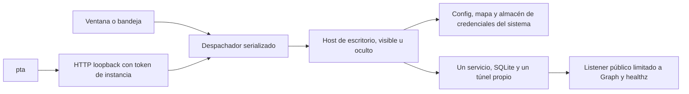

# GUI, CLI y agente

La instalación principal es mediante Cargo desde crates.io. El paquete `personal-teams-desktop` 0.2.0 entrega la GUI `personal-teams-desktop`, el CLI `pta` y la skill de operación incorporada. Requiere Rust y los prerrequisitos nativos de Tauri para compilar:

```sh
cargo install personal-teams-desktop --version 0.2.0 --locked
personal-teams-desktop
pta --version
```

El directorio `bin` de Cargo (normalmente `~/.cargo/bin`) debe estar en `PATH`. Ambos ejecutables comparten perfil, credenciales y servicio. `pta start` inicia el asistente con la GUI oculta; `pta app open` muestra su ventana. El CLI antiguo del núcleo sigue disponible por separado con `serve`, `check` y `local-info`; usa sus reglas de entorno y OAuth confidencial existentes.

Los binarios precompilados y bundles son alternativas accesorias. Para la alternativa macOS, arrastra la app del DMG a Applications. Sus dos ejecutables están en Contents/MacOS. Si elegiste ese bundle, habilita el CLI en un directorio elegido que ya esté en PATH:

```sh
"/Applications/Personal Teams Assistant.app/Contents/MacOS/pta" app install-cli "$HOME/.local/bin"
pta --version
```

El enlace apunta al ejecutable de la app y se actualiza junto con ella. El comando rechaza destinos ocupados. La implementación prevista para Windows incorpora ambos ejecutables en su directorio; PowerShell puede invocar `& 'RUTA_DE_INSTALACIÓN\pta.exe' --help`. `app install-cli DIRECTORIO` permite copiar la consola a un directorio elegido de PATH y registra la ubicación del host. Una copia de CLI en Windows requiere actualizarse junto con la instalación; no se elimina automáticamente al desinstalar la app. Los datos y credenciales no se borran por quitar los ejecutables.

`pta skill show`, `pta skill path` y `pta skill install DIRECTORIO_ABSOLUTO_NUEVO` entregan la skill de esa versión. Una instalación explícita rechaza archivos/directorios existentes. La fuente canónica del crate es `skills/personal-teams-assistant`; Cargo y bundles incorporan sus mismos textos compilados.

## Proceso y datos



La CLI inicia el mismo ejecutable con `--host` cuando necesita un dueño. `stop` detiene servicio/túnel; `app quit` también termina el host. Cerrar la ventana conserva el host. El lock del perfil se adquiere antes de inicializar archivos; el lock de datos excluye el servicio antiguo y los probes Microsoft. Nunca se envían señales basadas solo en un PID.

En macOS/Windows se usan las mismas rutas de Tauri (`dev.personalteams.assistant`) y el perfil `default` del almacén del sistema. El directorio de datos importado se conserva. La clave de cifrado existente debe seguir validando los tokens; una clave diferente se rechaza. El primer acceso o un cambio de firma puede requerir autorización protegida del sistema.

El endpoint administrativo usa un puerto loopback separado y token aleatorio por instancia, guardado en un archivo privado. Rechaza Origin, autorización ausente o de otra instancia; no expone CORS ni rutas administrativas en el listener Graph. Los archivos usan permisos 0600/0700 en Unix y ACL de la cuenta en Windows.

## Contrato 1

`--json` devuelve un documento con contract, version, ok, code, exit_code, message, data y revision. La ayuda y versión también admiten JSON. No se imprimen credenciales ni cuerpos de errores de proveedores. Progreso/diagnóstico va a stderr. No hay streaming en este contrato.

| Exit | Significado |
| --- | --- |
| 0 | Operación concluida |
| 1 | Operación fallida; consultar estado antes de repetir |
| 2 | Entrada o validación inválida |
| 3 | Configuración/conexión pendiente |
| 4 | Autorización pendiente de persona |
| 5 | Dependencia, red o instalación no disponibles |
| 6 | Conflicto de revisión/contrato/estado |

`--non-interactive` inicia OAuth devolviendo URL/código sin abrir navegador; nunca acepta consentimiento. `auth PROVIDER finish --wait` tiene un máximo de 600 segundos; sin wait devuelve el estado inmediato. `cancel` termina la espera. Login Microsoft pausa el servicio; cancelación/fallo puede dejarlo detenido y requiere inspección. Logout elimina tokens locales; no revoca el consentimiento remoto.

Las mutaciones pasan por el mismo dueño y las operaciones basadas en un snapshot verifican revisión. Guardado valida antes de parar, prepara un journal de recuperación, escribe archivos privados y reinicia si estaba ejecutándose. Un reinicio fallido no equivale a servicio activo: consulta status para conocer configuración aplicada y estado cargado. Las operaciones de red son acotadas; tras timeout no repitas una mutación antes de inspeccionar. Auditoría usa conexiones de lectura y no recupera jobs.

Consulta `pta --help` para la superficie completa y [el inventario de paridad](cli-parity.md) para su relación con operaciones y verificaciones. `config show/get/set/apply/validate` expone todos los campos serializados del esquema. `config apply/validate` lee un objeto JSON/TOML con config y map (tunnel_config es opcional). Reemplazar objetos/listas requiere conservar los elementos deseados. Cambiar data_dir requiere importación explícita con servicio detenido. Quitar repositorios preserva archivos y rechaza mapas con fuentes dependientes inválidas.

## Respuestas y chat personal

`policy.max_answer_chars` limita una respuesta normal (1–4000); `policy.max_detailed_answer_chars` limita una detallada (hasta 16000 y nunca menor que la normal). En perfiles anteriores el segundo campo toma 8000 por defecto. DeepSeek decide el modo según solicitud y contexto, devuelve JSON tipado y recibe ambos límites. Su API configura tokens, mientras la aplicación verifica caracteres Unicode antes del control final y el envío. Una respuesta que excede el límite queda sin enviar; no se corta una afirmación aprobada a la mitad. Los saludos usan el límite normal. La API Graph tiene además límites de tamaño del cuerpo.

`self-chat enable [ID]` comprueba /me, chat oneOnOne y miembros exclusivamente del usuario conectado. El hilo especial de notas `48:notes` no expone metadata/membresía ChatThread: se valida su colección delegada `/me/chats/48:notes/messages` y que todos sus mensajes de usuario tengan el autor de la cuenta conectada. Debe existir al menos una nota para comprobarlo. Es un candidato que se verifica, no una regla universal para toda cuenta. Ver [notas personales de Teams](https://learn.microsoft.com/en-gb/answers/questions/908538/chat-id-returns-unknown-error) y [lectura delegada de mensajes](https://learn.microsoft.com/en-us/graph/api/chat-list-messages). Habilitación persiste un instante de corte; solo preguntas creadas después se procesan. Las fuentes conservan sus audiencias y deben autorizarse al chat exacto. La recepción combina webhook con polling cada 10 segundos de una página de hasta 50 mensajes, ordenada por creación; mantiene cursor de diagnóstico y deduplicación en SQLite. Gaps mayores quedan para atención manual, sin reproducir historial antiguo.

Cada salida personal tiene ID y un enlace PTA con nonce registrado antes de enviar. Esto permite reconocer webhooks adelantados y envíos ambiguos incluso tras reiniciar. Un mensaje humano que repite el texto de una respuesta sigue siendo elegible. Si Graph elimina la marca y además se pierde el resultado del envío, el chat personal se pausa mientras exista una salida sin ID, en vez de arriesgar un bucle. `self-chat status` informa las salidas sin resolver; requiere reconciliación manual. Un envío nunca se reintenta automáticamente. Los mensajes propios en otros chats siguen excluidos.

`doctor --offline` valida archivos; doctor inspecciona metadatos y distingue salud persistida/cargada. `test providers` usa datos ficticios y consume API; `test connectivity` lee la cuenta Graph. `test simulate` y chat usan el pipeline local y nunca envían a Graph. `test self-chat` comprueba membresía y declara que no verificó extremo a extremo. El cierre real exige una pregunta nueva, auditoría de envío y respuesta visible en Teams, con prueba de reinicio y ausencia de bucles.

## Roadmap Windows (próxima versión)

Windows queda fuera de esta entrega por decisión del usuario. Se conserva su compilación existente en CI; quedan para la próxima versión el instalador conjunto, actualización de CLI/PATH, pruebas funcionales de consola/bandeja/Credential Manager/ACL, inicio-parada-reinicio, desinstalación sin pérdida de datos y firma según los medios disponibles. El código común conserva los puntos de integración, sin declarar validación funcional ni distribución estable Windows.

Ante una salida ambigua sin marca recuperable, `self-chat status` lista pending_outputs con nonce y fecha. Tras identificar personalmente su mensaje en Teams/Graph, `pta self-chat reconcile NONCE MESSAGE_ID` registra la correspondencia explícita; valida cuenta, conversación y fecha y no reenvía nada. El agente necesita que la persona identifique esa salida si Graph no conservó la marca.
